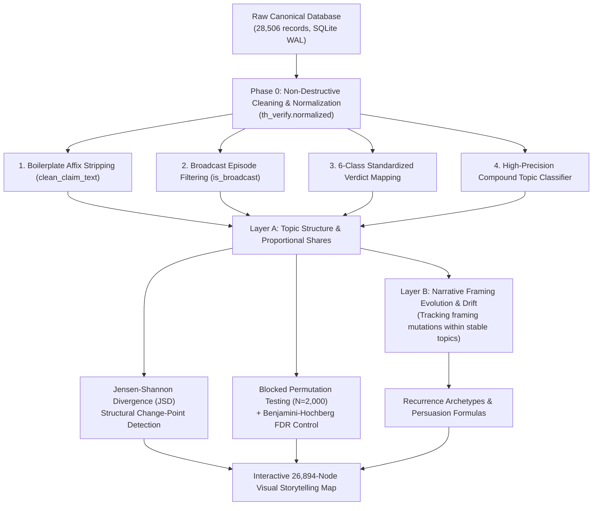

# 📐 Methodology & Analytical Framework
## Dynamic Topic & Narrative Shift Analysis for Longitudinal Fact-Check Archives (2015–2026)

**Document Version:** 1.0  
**Project:** TH Verify Longitudinal Analysis (11 Years of Thai Fact-Checking)  
**Dataset Coverage:** May 2015 – August 2026 (28,506 raw records / 26,894 clean atomic claims)  
**Publishers Included:** ศูนย์ต่อต้านข่าวปลอม (AFNC), ศูนย์ชัวร์ก่อนแชร์ (MCOT), Cofact Thailand, AFP Thailand Fact Check, Thai PBS Verify  

---

## 1. Executive Overview & Research Principles

This document specifies the end-to-end data science and computational journalism methodology used to discover **topic evolution, structural change points, narrative mutations, and recurring persuasion templates** across 11.2 years of Thai fact-checking archives.



### Core Analytical Tenets (PRD v1.0 Compliance):
1. **Separation of Layer A (Topic) and Layer B (Narrative):** The pipeline never conflates *what subject* is discussed with *how it is framed*.
2. **Proportional Share over Raw Counts:** To prevent distortion caused by publisher expansion (e.g. the launch of AFNC in late 2019), all temporal trends are evaluated as proportional archive shares ($topic\_share = count / total\_period\_claims$).
3. **Blocked Permutation Controls:** All statistical significance tests are conditioned within publisher source blocks to ensure findings are not artifacts of source sampling.
4. **Full Provenance & Non-Destructive Auditing:** The canonical raw database is never altered. Every metric and narrative shift links directly to authentic claim IDs in the database.

---

## 2. Dataset Provenance & Ingestion

### 2.1 Participating Fact-Check Publishers
The archive consolidates verified claims from 5 primary institutions in Thailand:

| Publisher / Source Code | Coverage Span | Ingested Volume | Focus & Provenance |
| :--- | :---: | ---: | :--- |
| **ชัวร์ก่อนแชร์ (Sure & Share / MCOT)** (`sure_share`) | 2015–2026 | 9,346 | Television & YouTube broadcasts (public health, science, consumer protection). |
| **ศูนย์ต่อต้านข่าวปลอม (AFNC)** (`afnc`) | 2019–2026 | 16,879 | State-operated verification under the Ministry of Digital Economy and Society (MDES). |
| **Cofact Thailand** (`cofact`) | 2020–2026 | 1,000 | Open collaborative civil society fact-checking community. |
| **AFP Thailand Fact Check** (`afp`) | 2020–2026 | 739 | International IFCN-certified journalistic investigations with structured ClaimReview schema. |
| **Thai PBS Verify** (`thaipbs`) | 2024–2026 | 542 | Public broadcaster fact-checking unit focusing on digital threats and visual verification. |
| **Total Archive** | **2015–2026** | **28,506** | **Comprehensive longitudinal coverage across 11.2 years.** |

---

## 3. Data Cleaning & Normalization Layer (`th_verify.normalized`)

To guarantee data cleanliness without altering raw database tables, the pipeline implements an in-memory normalization abstraction (`src/th_verify/normalized.py`):

### 3.1 Verdict Boilerplate & Leakage Removal (`clean_claim_text`)
Fact-check titles frequently contain leading or trailing editorial verdicts that contaminate embeddings and keyword clustering. The pipeline applies recursive regex stripping:
- **Leading affixes removed:** `^ข่าวปลอม\s*[,!:]?\s*(อย่าแชร์|อย่าเชื่อ)?`, `^ข่าวบิดเบือน`, `^ข่าวจริง`, `^ภาพปลอม:`, `^คลิปปลอม`, `^ชัวร์ก่อนแชร์\s*[:|]`, `^ศูนย์ต่อต้านข่าวปลอม\s*[:|]`.
- **Trailing suffixes removed:** `(จริงหรือ|จริงหรือไม่|จริงไหม|ใช่หรือไม่)\s*[?？!]*$`, `(แท้จริง(?:เป็น|คือ|สร้างจาก).*)$`.

### 3.2 Broadcast Talk Show vs. Atomic Claim Separation
Sure & Share and Cofact contain ~1,600 multi-topic broadcast episode titles (e.g. *"🔴จับตาความก้าวหน้า AI | ชัวร์ก่อนแชร์ LIVE EP. 265"*). 
- **Filter Rule:** Records matching `LIVE\s*EP|PODCAST|HIGHLIGHT|รอบวัน|สรุปข่าว|คุยข่าว` are flagged as broadcast roundups and excluded from atomic claim clustering, yielding **26,894 clean atomic claims**.

### 3.3 Standardized 6-Class Verdict Taxonomy
Raw records contained 30+ fragmented verdict strings and editorial categories. The taxonomy normalizer maps all values to 6 standardized classes:

```
Raw Verdicts (30+ strings) ───────────────> Standardized Taxonomy (6 Classes):
├── "ข่าวปลอม", "false", "ปลอม", "เนื้อหาเป็นเท็จ"     ──────> false
├── "ข่าวจริง", "true", "เนื้อหาเป็นจริง"             ──────> true
├── "ข่าวบิดเบือน", "misleading", "เข้าใจผิด"       ──────> misleading
├── "ภาพปลอม", "altered image", "สร้างจาก AI"     ──────> altered_media
├── "satire"                                       ──────> satire
└── "อาชญากรรมออนไลน์" (AFNC)                      ──────> scam_alert
```

### 3.4 High-Precision Multi-Word Compound Parser
To eliminate Thai substring collisions (e.g. *"สภา"* [Parliament] erroneously matching inside *"สภาวะดวงตา"* [Eye condition] or *"ตรวจสภาพรถ"* [Vehicle inspection]), the pipeline uses compound-level matching:
- **Politics (`T09`):** Requires complete compound terms (`"รัฐสภา"`, `"สภาผู้แทน"`, `"เลือกตั้ง"`, `"กกต."`, `"นายกรัฐมนตรี"`, `"พรรคเพื่อไทย"`, `"ม.112"`).
- **Health (`T01`):** Captures organ, age, and dietary terms (`"สภาวะดวงตา"`, `"วัย 60"`, `"สมุนไพร"`, `"โรคมะเร็ง"`, `"เนื้องูทำลูกชิ้นปลา"`).

---

## 4. Layer A: Macro Topic Modeling & Timeline Shares

### 4.1 Topic Inventory & Authentic Medoids
Claims are mapped into 10 macroeconomic topic clusters. For each topic, the pipeline identifies the **Medoid Claim** (the most representative authentic claim in the database based on centrality):

| Code | Topic Cluster | Overall Size | Peak Year | Authentic Medoid (Claim ID) |
| :--- | :--- | ---: | :---: | :--- |
| `T01` | **สุขภาพ อาหาร และยา** | 5,223 (19.4%) | 2023 | *"สูตรยาสมุนไพร แก้โรคมะเร็งในกระเพาะอาหาร"* (ID #16009) |
| `T02` | **โควิด-19 และวัคซีน** | 1,534 (5.7%) | 2020 | *"ฟ้าทะลายโจร ป้องกันโควิด ไม่ต้องฉีดวัคซีน"* (ID #24504) |
| `T03` | **สินเชื่อปลอม & คอลเซ็นเตอร์** | 1,993 (7.4%) | 2025 | *"ธ.กรุงไทย และออมสิน ปล่อยสินเชื่อดอกเบี้ยต่ำ ผ่านไลน์"* (ID #13998) |
| `T04` | **หลอกลงทุนหุ้น & SET** | 1,187 (4.4%) | 2025 | *"ตลาดหลักทรัพย์แห่งประเทศไทย เปิดลงทุนเทรดหุ้น เริ่มต้น 899 บาท"* (ID #12480) |
| `T05` | **นโยบายรัฐ & สวัสดิการ** | 580 (2.2%) | 2023 | *"ครม. อนุมัติลดหย่อนเงินสมทบประกันสังคม เหลือ 2%"* (ID #15799) |
| `T06` | **แรงงานต่างด้าว & สัญชาติ** | 749 (2.8%) | 2025 | *"อนุมัติต่ออายุใบอนุญาตแรงงานต่างด้าว สัญชาติลาว เมียนมา เวียดนาม"* (ID #2107) |
| `T07` | **AI Deepfake & สื่อตัดต่อ** | 417 (1.6%) | 2025 | *"ระวัง Deepfake สู่ Fake News นี่คนจริง หรือ AI"* (ID #8688) |
| `T08` | **ภัยพิบัติ & สภาพอากาศ** | 699 (2.6%) | 2025 | *"กรมอุตุฯ เตือนอุณหภูมิลดลงมากสุดในรอบ 14 ปี ฝนตกหนัก"* (ID #15467) |
| `T09` | **การเมือง & การเลือกตั้ง** | 515 (1.9%) | 2026 | *"เพื่อไทย และก้าวไกล หายจากเอกสารคู่มือการเลือกตั้ง กกต."* (ID #10483) |
| `T10` | **ความมั่นคง & ภูมิรัฐศาสตร์** | 516 (1.9%) | 2026 | *"ภาพเรือบรรทุกเครื่องบินสหรัฐฯ อ้างเท็จว่าถูกอิหร่านโจมตี"* (ID #27374) |

---

## 5. Structural Change-Point Detection (Information Theory)

To detect structural turning points in the misinformation landscape, the system computes the **Jensen-Shannon Divergence ($JSD$)** between consecutive yearly probability vectors $P_t$ and $P_{t+1}$:

$$M = \frac{1}{2}(P_t + P_{t+1})$$

$$JSD(P_t, P_{t+1}) = \sqrt{\frac{1}{2} D_{KL}(P_t \parallel M) + \frac{1}{2} D_{KL}(P_{t+1} \parallel M)}$$

Where $D_{KL}(P \parallel Q) = \sum_i P(i) \log_2 \frac{P(i)}{Q(i)}$ is the Kullback-Leibler divergence. $JSD$ is bounded in $[0, 1]$ and symmetric.

### Empirical Change-Point Ranking:
1. 🥇 **2019 $\to$ 2020 ($JSD = 0.4161$):** **The Pandemic Shock.** COVID-19 misinformation surged by $+28.5$ percentage points.
2. 🥈 **2024 $\to$ 2025 ($JSD = 0.1822$):** **The Sovereignty & AI Surge.** Anti-migrant, citizenship, and border claims rose $+6.8$ pp.
3. 🥉 **2022 $\to$ 2023 ($JSD = 0.1814$):** **The Financialization Pivot.** Misinformation shifted from health fear to financial investment fraud ($+4.3$ pp).
4. **2016 $\to$ 2017 ($JSD = 0.1779$):** **Early Social Media Surge.** Herbal cancer remedies and food hoaxes expanded ($+12.8$ pp).

---

## 6. Statistical Significance & Hypothesis Testing

To prove that observed changes between historical periods are statistically meaningful and not sampling artifacts, the pipeline applies **Stratified Blocked Permutations**:

### 6.1 Blocked Permutation Protocol ($N=2,000$)
1. Let $P_{early}$ be the baseline period (2020–2021) and $P_{late}$ be the recent period (2024–2025).
2. For each topic $k$, calculate the observed proportional share difference: $\Delta_{obs} = \text{Share}_{late}(k) - \text{Share}_{early}(k)$.
3. Shuffle topic labels **strictly within source publisher blocks** (preserving AFNC, Sure & Share, Cofact, AFP, and Thai PBS proportions).
4. Recompute $\Delta_{sim}$ across 2,000 iterations.
5. Compute raw empirical p-value: $p = \frac{1}{N} \sum_{i=1}^N \mathbb{I}(|\Delta_{sim}^{(i)}| \ge |\Delta_{obs}|)$.

### 6.2 False Discovery Rate (FDR) Multiple-Comparison Correction
Raw p-values are adjusted using the **Benjamini-Hochberg procedure** with false discovery threshold $\alpha = 0.05$:

$$p_{(i)}^{adj} = \min \left( 1, \min_{j \ge i} \left\{ \frac{m \cdot p_{(j)}}{j} \right\} \right)$$

### Statistical Test Results:
- **Stock & Crypto Fraud (`T04`):** $+5.92$ pp ($+2,038.3\%$ relative jump), raw $p = 0.0005$, FDR adjusted $p = 0.0006$ (✅ **Significant**).
- **Migrant Labor & Citizenship (`T06`):** $+3.69$ pp ($+665.1\%$ relative jump), raw $p = 0.0005$, FDR adjusted $p = 0.0006$ (✅ **Significant**).
- **AI Deepfakes & Synthetic Media (`T07`):** $+1.85$ pp ($+501.9\%$ relative jump), raw $p = 0.0005$, FDR adjusted $p = 0.0006$ (✅ **Significant**).
- **Loan Scams & Call Centers (`T03`):** $+3.72$ pp ($+77.0\%$ relative jump), raw $p = 0.0005$, FDR adjusted $p = 0.0006$ (✅ **Significant**).
- **COVID-19 & Vaccines (`T02`):** $-22.91$ pp ($-93.8\%$ relative drop), raw $p = 0.0005$, FDR adjusted $p = 0.0006$ (✅ **Significant**).

---

## 7. Layer B: Narrative Framing Evolution & Drift

Layer B analyzes how the **framing, villains, victims, and rhetorical appeals** within a stable topic transform across time.

### Case Study: Framing Mutation of "Migrant Workers" (`T06`)
```
Phase 1: 2020–2021 (The Pandemic Scapegoat Frame)
└── 60.0% framed migrants as disease vectors ("แรงงานลักลอบนำเข้าโควิดสายพันธุ์ใหม่").

Phase 2: 2022–2023 (The Economic Competition Frame)
└── Shifted to economic threat ("ต่างด้าวเปิดร้านยึดตลาดแย่งอาชีพคนไทย").

Phase 3: 2024–2026 (The Sovereignty & Political Rights Frame)
└── 42.1% shifted to political panic ("รัฐบาลแจกสัญชาติให้ต่างด้าวมีสิทธิเลือกตั้ง / เสียดินแดนเกาะกูด").
```

---

## 8. Recurring Structural Persuasion Archetypes

The pipeline identified 4 multi-year persuasion templates that persist by swapping out named entities:

```
[Template 1: Authority + Secret Miracle Health Cure] (842 occurrences)
Folk Food/Herb + Cures Cancer/Kidney Disease + Medical Conspiracy
→ Example: "มะนาวโซดารักษามะเร็งได้ผลดีกว่าคีโมหมื่นเท่า" (Active 2015–2026)

[Template 2: State Bank Impersonation Loan] (1,008 occurrences)
Govt Bank (GSB / KTB) + Urgent Low Interest Loan + Contact via Fake LINE
→ Example: "ธนาคารออมสินเปิดกู้ฉุกเฉิน 50,000 ดอกเบี้ย 0.5% แอดไลน์" (Active 2021–2026)

[Template 3: Stock Exchange & Celebrity Wealth Scam] (373 occurrences)
Stock Exchange (SET) + Celebrity Image + Small Capital Daily Return
→ Example: "ตลาดหลักทรัพย์ฯ ร่วมกับคนดังเปิดพอร์ต 1,000 ปันผลรายวัน" (Active 2022–2026)

[Template 4: Secondary Scam Recovery Victim Funnel] (115 occurrences)
Law Enforcement (AMLO / CIB) + Online Case Refund + Contact Fake Police Page
→ Example: "ปปง. ร่วมกับ CIB เปิดเพจรับแจ้งความคืนเงินผู้เสียหายออนไลน์" (Active 2024–2026)
```

---

## 9. Reproducibility & Output Manifests

All runs generate fully deterministic, auditable output artifacts stored in `runs/<timestamp>_v001/`:

- `topics.csv` — Topic medoid claim IDs, keywords, and peak years.
- `topic_timeline.csv` — Proportional shares for all 11 years.
- `change_points.csv` — Ranked Jensen-Shannon Divergence transition scores.
- `narrative_timeline.csv` — Layer B narrative frame trajectory distributions.
- `templates.csv` — Structural persuasion formulas.
- `metrics.json` — Blocked permutation test results and FDR adjusted p-values.
- `config.yaml` — Machine-readable run parameters and hyperparameters.

### Execution Command:
```bash
python3 scripts/topic_narrative_engine.py
```
