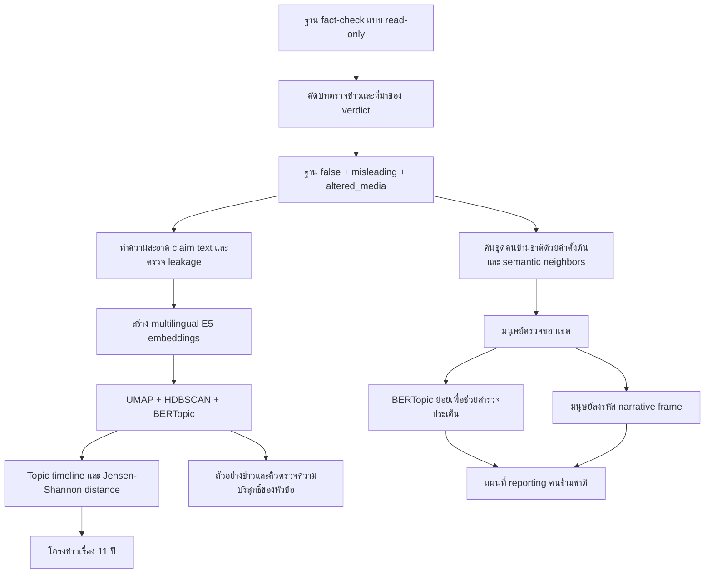

# วิธีวิเคราะห์ข่าวลวงไทยตามเวลา: BERTopic + การตรวจกรอบเรื่องเล่าโดยมนุษย์

**เวอร์ชัน:** 2.0  
**สถานะ:** วิธีที่แนะนำสำหรับข่าว 2 ชิ้นของโครงการ  
**ข้อมูลที่ใช้ในรอบปัจจุบัน:** snapshot ตัดวันที่ 2 กันยายน 2569  
**วันที่จัดทำเอกสาร:** 14 กันยายน 2569

เอกสารนี้อธิบายวิธีที่ควรใช้ตอบคำถามข่าวสองข้อ:

1. ในรอบกว่า 11 ปี หัวข้อของข่าวลวงที่สำนักตรวจสอบข้อเท็จจริงในไทยเลือกตรวจเปลี่ยนไปอย่างไร
2. ข่าวลวงเกี่ยวกับคนข้ามชาติในประเทศไทยเล่าเรื่องคนกลุ่มนี้ผ่านประเด็นและกรอบเรื่องเล่าแบบใด และกรอบเหล่านั้นเปลี่ยนหรือกลับมาอย่างไรตามเวลา

ข้อเสนอหลักคือให้ใช้ **BERTopic เป็นเครื่องมือค้นหาโครงสร้างหัวข้อ** และใช้ **การอ่านและลงรหัสโดยมนุษย์เป็นเครื่องมือวิเคราะห์ narrative** สองส่วนนี้ตอบคนละคำถามและต้องไม่ใช้แทนกัน

---

## 1. หลักคิดของวิธีนี้

### 1.1 หัวข้อไม่เท่ากับกรอบเรื่องเล่า

- **Topic** ตอบว่า “ข่าวลวงพูดถึงเรื่องอะไร” เช่น การรักษาไวรัส ใบขับขี่ออนไลน์ การลงทุน หรือเอกสารสัญชาติ
- **Narrative frame** ตอบว่า “เรื่องนั้นถูกเล่าอย่างไร” เช่น วางคนข้ามชาติเป็นภัยสุขภาพ คู่แข่งทางงาน ผู้ได้รับสิทธิเกินควร หรือภัยความมั่นคง

BERTopic สามารถช่วยค้นหัวข้อที่ใช้คำหรือความหมายคล้ายกัน แต่ไม่สามารถตัดสินเจตนา ผู้ร้าย ผู้เสียหาย ความเกลียดชัง หรือการลดทอนความเป็นมนุษย์ได้อย่างน่าเชื่อถือโดยลำพัง งานเหล่านี้ต้องอ่านเนื้อหาและหลักฐานต้นทาง

### 1.2 วิเคราะห์สัดส่วน ไม่ใช้จำนวนดิบเพียงอย่างเดียว

จำนวนบทตรวจข่าวเพิ่มขึ้นมากหลังมีสำนักใหม่และหลังนโยบายการตรวจข่าวเปลี่ยน การเปรียบเทียบจำนวนดิบข้ามปีจึงอาจสะท้อนการขยายตัวของผู้ตรวจข่าวมากกว่าการเปลี่ยนของข่าวลวง

ตัวชี้วัดหลักคือ:

```text
topic share ในช่วงเวลา t
= จำนวนบันทึกที่อยู่ใน topic k และช่วงเวลา t
÷ จำนวนบันทึกข่าวลวงทั้งหมดในช่วงเวลา t
× 100
```

ต้องแสดงจำนวนจริงควบคู่กับสัดส่วนเสมอ โดยเฉพาะช่วงที่ตัวหารเล็ก

### 1.3 หน่วยวิเคราะห์คือ “บันทึกการตรวจข่าว”

หนึ่งแถวหมายถึงบทตรวจสอบหนึ่งชิ้นจากสำนักหนึ่ง ไม่ใช่:

- ข่าวลวงที่ไม่ซ้ำหนึ่งเรื่อง
- โพสต์ต้นเหตุหนึ่งโพสต์
- จำนวนครั้งที่ข่าวถูกแชร์
- จำนวนคนที่เห็นหรือเชื่อ

ข้ออ้างเดียวอาจถูกตรวจหลายครั้ง หลายสำนัก หรือกลับมาในหลายปี ผลจึงอธิบาย **คลังงานตรวจข่าว** ไม่ใช่ปริมาณข่าวลวงทั้งหมดในสังคมไทย

---

## 2. ภาพรวมขั้นตอน



---

## 3. ขอบเขตข้อมูล

### 3.1 สำนักที่รวมในฐาน

- ศูนย์ต่อต้านข่าวปลอมประเทศไทย (`afnc`)
- ชัวร์ก่อนแชร์ / MCOT (`sure_share`)
- Cofact Thailand (`cofact`)
- AFP Thailand Fact Check (`afp`)
- Thai PBS Verify (`thaipbs`)

ข้อมูลรอบปัจจุบันมี 29,001 แถวในฐานดิบ แต่ไม่ควรนำทุกแถวมาวิเคราะห์เป็นข่าวลวง

### 3.2 เกณฑ์คัดเข้า

เก็บเฉพาะแถวที่ผ่านทุกเงื่อนไขต่อไปนี้:

1. เป็นบทตรวจสอบข้ออ้าง ไม่ใช่บทความทั่วไป กิจกรรม ข่าวประชาสัมพันธ์ รายการสรุปข่าว หรือรายการหลายประเด็น
2. มีวันที่เผยแพร่ภายในช่วง snapshot
3. มีข้อความข้ออ้างหรือชื่อข่าวหลังทำความสะอาดอย่างน้อย 10 ตัวอักษร
4. verdict มี provenance เป็น `source` หรือ `human`
5. verdict ที่แปลงมาตรฐานแล้วเป็น `false`, `misleading` หรือ `altered_media`

ไม่ใช้ป้ายจาก LLM เป็นคำตัดสินหลัก และไม่รวม `true`, `unknown`, `satire` หรือ `scam_alert` ในฐานหลักของบทความ “ข่าวลวง”

### 3.3 การกระทบยอดรอบปัจจุบัน

| ขั้น | จำนวนบันทึก |
|---|---:|
| ฐานดิบ | 29,001 |
| ผ่านเกณฑ์เป็นฐานเปรียบเทียบ รวมผลจริง | 19,326 |
| ผลจริงที่แยกออกจากฐานข่าวลวง | 4,897 |
| ฐานหลัก `false + misleading + altered_media` | 14,429 |
| ข้อความตรงกันทุกตัวอักษรไม่ซ้ำที่ใช้ fit | 13,377 |

ฐานหลักแบ่งเป็น `false` 11,899, `misleading` 2,465 และ `altered_media` 65 บันทึก ตัวเลขทั้งหมดต้องอ้างพร้อมวันตัดข้อมูล

### 3.4 ขอบเขตเวลา

ฐานเริ่มในปี 2558 และรอบปัจจุบันสิ้นสุดต้นเดือนกันยายน 2569 จึงเรียกได้ว่า “กว่า 11 ปี” แต่ครอบคลุมป้ายปีปฏิทิน 12 ปี

- ปี 2558 ไม่เต็มปี
- ปี 2569 ไม่เต็มปี
- วันที่ที่ใช้คือวันที่สำนักเผยแพร่บทตรวจสอบ ไม่จำเป็นต้องเป็นวันที่ข่าวลวงเริ่มแพร่

ไม่ควรเปรียบเทียบปี 2569 กับปีเต็มโดยตรงโดยไม่แสดงว่าเป็นข้อมูลบางส่วน

---

## 4. การทำความสะอาดข้อความ

### 4.1 เลือกข้อความข้ออ้างโดยดู provenance

เลือกข้อความตามลำดับดังนี้:

1. ใช้ช่อง `claim` เมื่อมีข้อความและ `claim_origin` เป็น `source`, `human` หรือ `llm`
2. หากไม่มี ใช้ชื่อข่าวที่ตัดคำขึ้นต้น คำเฉลยท้ายประโยค hashtag และ boilerplate ของสำนักแล้ว

LLM ในขั้นนี้ใช้ช่วยสกัดข้อความ ไม่ได้ใช้ตัดสินว่าข่าวจริงหรือเท็จ

### 4.2 ป้องกัน editorial leakage

ตัดหรือทำคิวตรวจข้อความที่ยังมีคำเฉลยของผู้ตรวจข่าว เช่น “ข่าวปลอม”, “ตรวจสอบแล้ว”, “ไม่เป็นความจริง” หรือข้อความท้ายที่บอกว่าเป็นภาพ AI เพราะคำเหล่านี้อาจทำให้โมเดลจัดกลุ่มตามภาษาของสำนักแทนเนื้อหาข่าวลวง

รอบปัจจุบันพบคิวเสี่ยง 82 บันทึก การ fit ใหม่หลังตัดคิวนี้ทำให้จำนวนกลุ่มเปลี่ยนจาก 64 เป็น 56 และ ARI เทียบรอบหลักเท่ากับ 0.848 จึงต้องถือจำนวนคลัสเตอร์และขนาดแต่ละคลัสเตอร์เป็นผลที่ขึ้นกับการทำความสะอาด

### 4.3 การจัดการข้อความซ้ำ

- fit โมเดลหนึ่งครั้งต่อข้อความที่ตรงกันทุกตัวอักษร
- หลัง fit นำ label กลับไปใส่ทุกบันทึก เพื่อให้จำนวนตามปีและสำนักสะท้อนหน่วย “บทตรวจข่าว”
- เก็บ `text_family` สำหรับทดสอบความไวเมื่อรวมข้อความมาตรฐานเดียวกันภายในสำนักและปี
- ไม่ลบข้อความซ้ำข้ามปีโดยอัตโนมัติ เพราะการกลับมาของข้ออ้างเดิมเป็นข้อมูลเชิงข่าว

ข้อความต่างกันไม่จำเป็นต้องหมายถึงข่าวลวงคนละเรื่อง และข้อความเหมือนกันก็ไม่จำเป็นต้องมาจากโพสต์เดียวกัน

---

## 5. Layer A — การค้นหัวข้อด้วย BERTopic

### 5.1 เหตุผลที่ใช้ BERTopic

ไม่กำหนดว่าข่าวลวงไทยต้องมีเพียง 10 หมวดก่อนเห็นข้อมูล โมเดลช่วยเปิดทางให้พบหัวข้อเฉพาะที่กฎคำค้นกว้างอาจรวมเข้าด้วยกัน เช่น “รับทำใบขับขี่ออนไลน์” และ “อ้างคืนเงินให้ผู้เสียหาย”

กฎคำค้น T01–T10 ยังใช้ได้สำหรับ:

- ตรวจเทียบกับผลเก่า
- สร้างคิวค้น
- ตรวจว่าคลัสเตอร์สำคัญหลุดจากคำที่คาดไว้หรือไม่

แต่ไม่ใช้เป็น taxonomy สุดท้าย และห้ามนำรหัส T01–T10 ไปเท่ากับ topic ID ของ BERTopic

### 5.2 Embeddings

ใช้ `intfloat/multilingual-e5-small`:

- เติม prefix `passage: `
- ทำ L2 normalization
- เวกเตอร์ 384 มิติ
- ใช้ข้อความภาษาไทยเดิม ไม่แปลเป็นอังกฤษก่อนสร้างเวกเตอร์

#### ผล benchmark การเลือกโมเดล (14 กันยายน 2569)

ทดสอบแบบควบคุมสามแขนบน corpus เดียวกัน ได้แก่ E5 `passage:`, E5 `query:` และ `paraphrase-multilingual-MiniLM-L12-v2` โดยล็อกพารามิเตอร์ UMAP/HDBSCAN และรัน UMAP 3 seed ผลพบว่า E5 `passage:` เดิมมีความนิ่งสูงสุด (mean ARI 0.839) และมี noise ระดับบันทึกต่ำสุด (16.11%) ขณะที่ MiniLM แม้ได้ silhouette สูงกว่า แต่ความนิ่งต่ำกว่า (mean ARI 0.496) และมี noise 27.98%

ดังนั้น วิธีฉบับนี้ **คง E5 `passage:` สำหรับผล production ปัจจุบัน** เพื่อรักษาความทำซ้ำได้และความต่อเนื่องของสองสกู๊ป ไม่เปลี่ยนโมเดลจาก intrinsic metric เพียงค่าเดียว ดูรายละเอียดและข้อจำกัดใน [รายงาน embedding benchmark](../runs/20260914_embedding_ab_v001/REPORT_TH.md)

### 5.3 การลดมิติและจัดกลุ่ม

พารามิเตอร์หลักของรอบปัจจุบัน:

| ขั้น | ค่า |
|---|---|
| UMAP | `n_neighbors=15`, `n_components=10`, `min_dist=0`, `metric=cosine`, `random_state=42` |
| HDBSCAN | `min_cluster_size=30`, `min_samples=5`, `metric=euclidean`, `cluster_selection_method=eom` |
| BERTopic | multilingual, ใช้ embedding ที่คำนวณไว้, ไม่บังคับจำนวนหัวข้อ |
| ตัวแทนคำ | Thai `newmm` tokenizer + c-TF-IDF, unigram และ bigram |

HDBSCAN สามารถกำหนดบางข้อความเป็น `noise` หรือ topic `-1` ต้องเก็บ noise ไว้ในผลและในตัวหาร ไม่ควรบังคับทุกแถวเข้าสู่คลัสเตอร์

### 5.4 การตั้งชื่อหัวข้อ

ชื่อเครื่องจาก c-TF-IDF เป็นเพียงคำช่วยอ่าน นักข่าวต้องอ่านอย่างน้อย:

- ตัวอย่างใกล้ centroid 5–10 แถว
- ตัวอย่างจากปีต้น กลาง และปลาย
- ตัวอย่างจากหลายสำนักเมื่อมีข้อมูล
- แถวที่อยู่ใกล้ขอบเขตหรือมีคำ editorial leakage

ชื่อหัวข้อที่ผ่านการใช้ในบทความต้องมีผู้ตรวจ ชื่อผู้ตรวจ วันที่ และสถานะ เช่น `pending`, `reviewed` หรือ `rejected/mixed`

ตำแหน่งในภาพ 2D/3D ไม่ใช่หลักฐานว่าข่าวสองชิ้นเกี่ยวข้องกัน การตีความต้องย้อนกลับไปที่ข้อความและ URL จริง

### 5.5 Sensitivity analysis

ทดลอง `min_cluster_size` อย่างน้อย 15, 30, 50 และ 80 โดยกำหนดค่าหลักไว้ล่วงหน้า ไม่เลือกค่าที่ให้เรื่องเล่าน่าสนใจที่สุด

รอบปัจจุบันได้ 161, 64, 43 และ 33 หัวข้อตามลำดับ การเปลี่ยนจำนวนมากแสดงว่า:

- “64 หัวข้อ” ไม่ใช่จำนวนชนิดข่าวลวงจริงในประเทศไทย
- ใช้ความคงทนของทิศทางและตัวอย่างหลักสำคัญกว่าจำนวนคลัสเตอร์
- ผลที่หายหรือกลับทิศเมื่อเปลี่ยนพารามิเตอร์ต้องลดระดับเป็นสมมติฐาน

---

## 6. การทำ timeline ของหัวข้อ

### 6.1 Fit ครั้งเดียวทั้งช่วงเวลา

fit topic model บน corpus รวมครั้งเดียว แล้วนับสมาชิกของหัวข้อเดิมตามปี วิธีนี้ทำให้คำว่า topic เดียวกันมีความหมายพื้นฐานเดียวกันตลอดช่วงเวลา

ไม่ควร fit แยกปีแล้วจับคู่คลัสเตอร์ภายหลังเป็นวิธีหลัก เพราะ label อาจเปลี่ยนโดยไม่มีหลักฐานว่าความหมายเปลี่ยนจริง

### 6.2 สัดส่วนรายปีและรายช่วง

สำหรับแต่ละ topic รายงาน:

- จำนวนบันทึก
- ตัวหารของปีหรือช่วง
- สัดส่วนต่อฐานข่าวลวงในปีหรือช่วงนั้น
- สัดส่วนแยกสำนัก
- สถานะปีเต็มหรือบางส่วน

ช่วงเปรียบเทียบหลักที่ใช้กับเรื่องแรกคือ 2563–2564 เทียบ 2567–2568 เพราะเป็นช่วงสองปีเต็มเท่ากัน ช่วงนี้เป็นการเลือกเชิงบรรณาธิการเพื่อเปรียบเทียบยุคโควิดกับช่วงหลัง ไม่ใช่ผลที่อัลกอริทึมค้นพบว่าเป็น “ยุค”

### 6.3 คำที่เปลี่ยนภายในหัวข้อ

ใช้ BERTopic `topics_over_time` เพื่อดูคำตัวแทนของ topic เดิมในแต่ละปี โดยปิด `global_tuning` และ `evolution_tuning` ในรอบสำรวจ เพื่อไม่ทำให้ timeline เรียบเกินข้อมูลจริง

คำที่เปลี่ยนเป็นเบาะแสสำหรับ reporting ไม่ใช่หลักฐานว่ากรอบเรื่องเล่าเปลี่ยนจนกว่าจะตรวจข้อความจริง

---

## 7. ระยะห่างระหว่างปี

ใช้ Jensen–Shannon distance เปรียบเทียบเวกเตอร์สัดส่วนหัวข้อของปีติดกัน:

```text
JSDistance(Pt, Pt+1) = sqrt[JSDivergence(Pt, Pt+1)]
```

ค่ามากหมายถึงองค์ประกอบหัวข้อของสองปีต่างกันมาก แต่ไม่บอกว่า:

- ปีนั้นคือ change point ที่ยืนยันทางสถิติ
- เหตุการณ์ภายนอกเป็นสาเหตุ
- ข่าวลวงในสังคมทั้งหมดเปลี่ยนในระดับเดียวกัน

ให้เรียกว่า **“ปีที่องค์ประกอบในคลังตรวจข่าวเปลี่ยนมาก”** หรือ **“descriptive structural shift”** จนกว่าจะมีการทดสอบ change point ที่รวมความไม่แน่นอนของโมเดล แหล่งข้อมูล และขนาดตัวอย่าง

noise ต้องอยู่ในเวกเตอร์ เพราะการตัดออกจะทำให้สัดส่วนของหัวข้อที่เหลือสูงขึ้นโดยอัตโนมัติ

---

## 8. การควบคุมผลจากส่วนผสมสำนัก

AFNC มีน้ำหนักประมาณ 71.8% ของฐานหลัก การเพิ่มหรือลดของหัวข้ออาจเกิดจากสำนักที่มีสัดส่วนมากขึ้น ไม่ใช่การเปลี่ยนของข่าวลวงเพียงอย่างเดียว

ใช้ source-balanced blocked permutation ดังนี้:

1. เลือกสำนักที่มีอย่างน้อย 20 บันทึกทั้งช่วงต้นและช่วงปลาย
2. เก็บจำนวนแถวต้นช่วงและปลายช่วงจริงภายในแต่ละสำนัก
3. สุ่มสลับป้ายช่วงเวลาเฉพาะภายในสำนักนั้น 2,000 รอบ
4. คำนวณผลต่างสัดส่วนของแต่ละสำนัก
5. เฉลี่ยผลต่างโดยให้น้ำหนักแต่ละสำนักเท่ากัน
6. ใช้ empirical p-value แบบ `(exceed + 1) / (N + 1)`
7. ปรับหลายการทดสอบด้วย Benjamini–Hochberg FDR รวมทุก topic และ noise

ผลนี้ใช้ตรวจว่า “ทิศทางยังปรากฏเมื่อให้น้ำหนักสำนักเท่ากันหรือไม่” ไม่ใช่หลักฐานว่าหัวข้อนั้นเพิ่มในประชากรไทยทั้งหมด เพราะยังมีข้อจำกัดจาก:

- ข้ออ้างหรือแคมเปญที่ซ้ำกัน
- การพึ่งพากันตามเวลา
- การเปลี่ยนนโยบายคัดข่าวภายในสำนัก
- ความไม่แน่นอนจากการเลือกโมเดล
- จำนวนสำนักที่ผ่านเกณฑ์อาจน้อย

ให้เรียก p-value และ q-value ว่า **exploratory** และรายงาน effect size ควบคู่เสมอ

---

## 9. Layer B — วิธีวิเคราะห์คนข้ามชาติ

### 9.1 สร้าง retrieval pool

เริ่มจากกฎคำค้นที่มีความแม่นสูงสำหรับ:

- แรงงานข้ามชาติและคนต่างด้าว
- ผู้ลี้ภัย คนไร้รัฐ และคนไร้สัญชาติ
- เอกสาร สถานะบุคคล และสัญชาติ
- ชื่อกลุ่มหรือสัญชาติที่เกี่ยวข้องในบริบทไทย

จากนั้นใช้ cosine similarity ของ E5 embeddings ดึง semantic neighbors เพื่อพบข้อความที่ไม่ได้ใช้คำตรง กำหนดจำนวนเพื่อนบ้านหรือ threshold ไว้ก่อนดูผล และบันทึก `nearest_seed_id` กับ similarity ทุกแถว

semantic retrieval สร้าง “คิวตรวจ” ไม่ได้สร้างประชากรที่ยืนยันแล้ว

### 9.2 มนุษย์ตรวจขอบเขตก่อนวิเคราะห์

ผู้ตรวจต้องอ่าน title, claim, explanation และหน้า source เมื่อเข้าถึงได้ แล้วให้ค่าเดียวต่อแถว:

| ค่า | ความหมาย |
|---|---|
| `resident_refugee_status` | คนข้ามชาติที่อยู่ ทำงาน เรียน หรือมีสถานะในไทย รวมผู้ลี้ภัย/คนไร้รัฐในบริบทไทย |
| `crossborder_people_services` | คนหรือบริการที่ข้ามแดนและสัมพันธ์กับชีวิตหรือระบบบริการในไทย |
| `border_context_only` | ความขัดแย้งรัฐหรือดินแดน ไม่มีข้ออ้างต่อคนย้ายถิ่นในไทย |
| `foreign_only` | เหตุในต่างประเทศโดยไม่มีบริบทการย้ายถิ่นในไทย |
| `unrelated` | ไม่เกี่ยวกับคำถามวิจัย |
| `unclear` | หลักฐานไม่พอ ต้องตรวจเพิ่ม |

รอบปัจจุบันมีคิว 332 บันทึก ผู้ช่วยเสนอคัดเข้า 118 บันทึก กำกวม 7 และคัดออก 207 การคัดนี้ยังต้องให้มนุษย์ตรวจเต็มต้นทาง

### 9.3 BERTopic ย่อยใช้หา “ประเด็น” ไม่ใช่ narrative

หลังคัดขอบเขต สามารถ fit BERTopic ย่อยเพื่อช่วยแบ่งงาน reporting เช่น แรงงานและการเคลื่อนย้าย เอกสารและสัญชาติ บริการชายแดน ค่าแรง หรือโรงเรียน

พารามิเตอร์รอบสำรวจปัจจุบัน:

- UMAP: 5 มิติ, neighbors 10, cosine, seed 42
- HDBSCAN: `min_cluster_size=8`, `min_samples=3`, `cluster_selection_method=leaf`
- ทดสอบ `eom/leaf` และขนาดกลุ่ม 5, 8, 12, 20

ผล 6 หัวข้อย่อยและ noise 11 บันทึกเป็นแผนที่ช่วยค้นข่าว ไม่ใช่จำนวน narrative ที่ยืนยันแล้ว

### 9.4 Human narrative coding

การวิเคราะห์ narrative สำหรับตีพิมพ์ต้องมีมนุษย์ลงรหัสจากข้อความข่าวลวง ไม่ใช่จากถ้อยคำแก้ข่าวของผู้ตรวจ โดยหนึ่งแถวอาจมีหลาย frame:

| Frame | เกณฑ์รวม | สิ่งที่ไม่พอสำหรับการจัด frame |
|---|---|---|
| `health_threat` | วางคนข้ามชาติเป็นแหล่งโรคหรือภัยสุขภาพ | เพียงกล่าวถึงโรงพยาบาลหรือวัคซีน |
| `job_competition` | อ้างว่าแย่งงาน กดค่าแรง หรือยึดอาชีพคนไทย | ข่าวใบอนุญาตทำงานทั่วไป |
| `undeserved_entitlement` | อ้างว่าได้สิทธิหรือทรัพยากรเกินควร | ข้อมูลบริการรัฐที่ไม่มีกล่าวหา |
| `belonging_demography` | ผูกสัญชาติ ประชากร การเกิด หรือสิทธิการเมืองกับภัยการแทนที่ | ข่าวทะเบียนบุคคลทั่วไป |
| `security_intruder` | เหมารวมเป็นผู้บุกรุก อาชญากร หรือภัยความมั่นคง | ข่าวจับกุมบุคคลหนึ่งรายโดยไม่เหมารวม |
| `policy_service_misinformation` | ข้อมูลนโยบายหรือบริการผิด แต่ไม่พบกรอบโจมตีกลุ่มคนชัด | — |
| `unclear_or_other` | หลักฐานไม่พอหรือเป็นกรอบอื่น | — |

แต่ละการตัดสินต้องเก็บ:

- ข้อความหลักฐานสั้น ๆ
- ผู้พูดหรือผู้ถูกอ้าง
- กลุ่มคนที่ถูกกล่าวถึง
- เหตุผลการจัด frame
- URL และวันที่เข้าถึง
- ชื่อผู้ตรวจและวันที่ตรวจ
- ระดับความมั่นใจ

### 9.5 Reliability ของ human coding

ก่อนรายงานสัดส่วน narrative:

1. สร้าง codebook พร้อมตัวอย่างบวก ตัวอย่างลบ และกรณีขอบเขต
2. ให้ผู้ตรวจอย่างน้อย 2 คนลงรหัสชุดทดสอบที่กระจายปีและสำนัก
3. double-code อย่างน้อย 20% ของ corpus และทุกแถว `unclear`
4. วัด agreement ราย frame เช่น Cohen's kappa หรือ Krippendorff's alpha สำหรับข้อมูลหลายป้าย
5. ประชุมตกลงข้อขัดแย้งและบันทึกเหตุผล
6. ถ้า agreement ต่ำกว่าเกณฑ์ที่กำหนดไว้ล่วงหน้า ให้แก้ codebook และลงรหัสใหม่ก่อนตีพิมพ์สัดส่วน

> **ข้อยกเว้นที่บันทึกไว้ (7 ต.ค. 2569):** เรื่องที่ 2 จะลงรหัสโดยบรรณาธิการ **คนเดียว** ข้อ 2 และ 4 ข้างต้นทำไม่ได้ จึงใช้ **การลงรหัสซ้ำของคนเดิม (test-retest)** แทน: ลงรหัสทั้ง 513 แถว รอ 48 ชั่วโมง แล้วลงรหัสซ้ำแบบไม่เห็นคำตอบเดิม ≥ 20% ของชุดและทุกแถว `unclear` วัด Cohen’s kappa ระหว่างสองรอบ เกณฑ์ 0.6 เท่าเดิม นี่ไม่ใช่ inter-coder reliability และต้องเขียนเช่นนั้นในกล่องวิธีวิจัยของบทความ ผลของ AI เป็นผู้อ่านคนที่สองที่ให้ผู้ลงรหัสทบทวนข้อที่ต่างกัน ไม่ใช่การรับรองความถูกต้อง สคริปต์: `scripts/score_story2_single_coder.py`
>
> **อัปเดต (7 ต.ค. 2569):** แผนข้างต้นไม่ได้ดำเนินการ เจ้าของโครงการให้ AI ลงรหัสทั้ง 513 แถวและเลือกไม่ตรวจซ้ำโดยมนุษย์ จึงไม่มีค่า reliability ใดสำหรับ Story 2 ผลเป็น “AI-coded, unvalidated” และบทความใช้ได้เฉพาะจำนวนบันทึกและตัวอย่าง (ข้อมูลเทียบ 30 แถวที่คนลงเอง: ขอบเขตตรง 19/30) รายละเอียดที่ `deliverables/story2_coding/ai_coded/README_AI_CODING.md`

จนกว่าจะผ่านขั้นนี้ ให้รายงานกลุ่มจากโมเดลเป็น “ประเด็นที่พบในคิวตรวจ” ไม่ใช้คำว่า “กรอบครองยุค” หรือ “narrative เพิ่มขึ้น X%”

---

## 10. การตรวจข้ออ้างที่กลับมาและ persuasion template

เริ่มจาก `text_family` และความคล้ายของ embeddings เพื่อค้นข้ออ้างที่กลับมาในหลายปี จากนั้นให้มนุษย์ยืนยันว่า:

1. โครงสร้างการโน้มน้าวเหมือนกันจริง
2. ไม่ใช่เพียงมีชื่อหน่วยงานหรือคำทั่วไปเหมือนกัน
3. แต่ละ occurrence เชื่อมกับ record ID และ URL ได้
4. จำนวนที่รายงานคำนวณจากสมาชิกที่ตรวจแล้ว ไม่ใช่ตัวเลขที่เขียนคงที่ในสคริปต์

ถ้ายังไม่ผ่านการยืนยัน ให้เรียกว่า “recurring text family” หรือ “กลุ่มข้อความคล้ายที่กลับมา” ไม่เรียกว่า persuasion archetype ที่พิสูจน์แล้ว

---

## 11. การตรวจความไวที่ต้องรายงาน

อย่างน้อยต้องตรวจผลสำคัญด้วยมุมต่อไปนี้:

| ความเสี่ยง | การตรวจ |
|---|---|
| ขนาดคลัสเตอร์ | เปรียบเทียบ HDBSCAN `min_cluster_size` หลายค่า |
| Editorial leakage | fit ใหม่หลังตัดคิวข้อความเสี่ยง |
| ข้อความซ้ำ | เปรียบเทียบทุกบันทึกกับ same-source-year text dedup |
| ประเภท verdict | เปรียบเทียบฐานหลักกับ `false` เท่านั้น |
| ส่วนผสมสำนัก | แสดงรายสำนักและผล equal-source permutation |
| ปีไม่เต็ม | ไม่ใช้ปี 2558/2569 เป็นคู่เปรียบเทียบหลักโดยไม่ปรับขอบเขต |
| ขอบเขตคนข้ามชาติ | แสดงผล `resident_refugee_status` แยกจากขอบเขตรวม cross-border |
| ความบริสุทธิ์ของ topic | อ่านตัวอย่างหลายปี/หลายสำนักและบันทึก mixed clusters |

ผลที่สำคัญต่อ headline ควรคงทิศทางในหลาย specification ถ้าไม่คง ต้องรายงานความไม่แน่นอนแทนการเลือกเฉพาะผลที่สนับสนุนเรื่อง

---

## 12. หลักการเขียนข่าวจากผลวิเคราะห์

### เขียนได้

- “ในคลังบทตรวจข่าวห้าสำนัก สัดส่วนหัวข้อ X เพิ่มจากช่วง A เป็นช่วง B”
- “BERTopic แยกพบกลุ่มข้อความเกี่ยวกับ X ซึ่งไม่ปรากฏเป็นหมวดแยกใน taxonomy เดิม”
- “เมื่อให้น้ำหนักสำนักเท่ากัน ทิศทางยังอยู่/ไม่อยู่”
- “คิวคนข้ามชาติที่ผ่านการคัดเบื้องต้นพบหลายประเด็นซ้อนกันตามเวลา”

### ต้องหลีกเลี่ยง

- “ประเทศไทยมีข่าวลวง 64 ประเภท”
- “ข่าวลวงเรื่องนี้เพิ่มขึ้นในสังคมไทยทั้งหมด”
- “โมเดลพิสูจน์ว่าสังคมไทยเกลียดคนข้ามชาติมากขึ้น”
- “p-value พิสูจน์ว่าผลไม่ลำเอียง”
- “ปีที่ JSD สูงคือ change point ที่เหตุการณ์ X เป็นสาเหตุ”
- “ไม่พบคลัสเตอร์จึงแปลว่า narrative นั้นไม่มีอยู่”

ข่าวทุกชิ้นต้องวาง caveat ใกล้ตัวเลขที่ได้รับผล ไม่ซ่อนข้อจำกัดไว้ท้ายบทความเพียงอย่างเดียว

---

## 13. Provenance และ reproducibility

ทุก run ต้องอยู่ในโฟลเดอร์ใหม่ `runs/<date>_<method>_vNNN/` และเก็บอย่างน้อย:

- hash ของ input snapshot
- วันตัดข้อมูลและวันที่วิเคราะห์
- เวอร์ชันโมเดลและแพ็กเกจ
- random seed และ hyperparameters
- `assignments.csv` พร้อม record ID, source, date และ URL
- `topics.csv` พร้อมคำตัวแทนและ exemplars
- `topic_timeline.csv` พร้อม count, denominator และ share
- `adjacent_year_shifts.csv`
- ผล sensitivity ทุกแบบ
- คิว editorial leakage
- คิวและผล human review ที่แยกจากไฟล์เครื่อง
- hash ของสคริปต์และผลลัพธ์

ฐาน SQLite ต้องเปิดแบบ read-only ระหว่างการวิเคราะห์ ห้ามเขียนทับ raw record หรือผลตรวจจากสำนัก

ไฟล์ที่มนุษย์ลงรหัสแล้วต้องเก็บเป็นสำเนา versioned และสคริปต์ต้องไม่เขียนทับโดยอัตโนมัติ

---

## 14. ขั้นตอนก่อนอนุมัติตีพิมพ์

### เรื่องที่ 1: 11 ปีข่าวลวงไทย

- ตรวจ exemplars ของทุก topic ที่เข้าพาดหัว
- ตรวจว่าทิศทางคงอยู่หลัง leakage และ parameter sensitivity
- แสดง count/denominator/share และผลแยกสำนัก
- ตรวจว่าคำอธิบาย topic ไม่กว้างหรือแคบกว่าสมาชิกจริง
- ไม่ใช้ปี 2569 แบบบางส่วนสร้างข้อสรุป “ล่าสุดพุ่ง”

### เรื่องที่ 2: Narrative คนข้ามชาติ

- ให้คนตรวจขอบเขตครบทั้ง retrieval pool หรือประกาศ sampling plan
- เปิดต้นทางทุกกรณีที่จะใช้เป็นตัวอย่าง
- human-code frame ตาม codebook และวัด inter-coder reliability
- แยกแรงงาน ผู้ลี้ภัย คนไร้รัฐ คนข้ามแดน และข่าวภูมิรัฐศาสตร์
- สัมภาษณ์คนข้ามชาติอย่างปลอดภัยและขอความยินยอม
- ตรวจสิทธิ นโยบาย และตัวเลขบริการกับเอกสารที่มีผลในช่วงเวลานั้น

จนกว่างาน human coding จะเสร็จ เรื่องที่สองควรเล่าเป็น **การพบประเด็นหลายชุดที่ซ้อนและกลับมา** ไม่ควรฟันธงเป็นสามยุคของ narrative

---

## 15. การรันและไฟล์อ้างอิงปัจจุบัน

รันจากรากโครงการตามลำดับ:

```bash
.venv/bin/python scripts/build_journalist_handoff.py
.venv/bin/python scripts/discovered_timeline.py
.venv/bin/python scripts/migrant_discovered_review.py
.venv/bin/python scripts/check_discovery_leakage.py
.venv/bin/python scripts/render_discovered_timeline.py
```

ก่อนรันใหม่ต้องสร้าง output directory เวอร์ชันใหม่เมื่อ input snapshot เปลี่ยน และต้องเก็บสำเนางาน human review แยกจาก output ที่สคริปต์สร้าง

ไฟล์หลักของรอบปัจจุบัน:

- [สรุปผลและข้อจำกัด](../runs/20260908_bertopic_v001/README_TH.md)
- [พารามิเตอร์โมเดล](../runs/20260908_bertopic_v001/config.json)
- [ผลตรวจข้อมูลและกราฟ](../runs/20260908_bertopic_v001/VERIFICATION.md)
- [Topic assignments](../runs/20260908_bertopic_v001/assignments.csv)
- [Topic timeline](../runs/20260908_bertopic_v001/topic_timeline.csv)
- [Migrant scope decisions](../runs/20260908_bertopic_v001/migrant_scope_decisions.csv)
- [Migrant screened assignments](../runs/20260908_bertopic_v001/migrant_screened_assignments.csv)
- [โครงข่าวเรื่องที่ 1](../runs/20260908_bertopic_v001/story_1_model_outline_th.md)
- [โครงข่าวเรื่องที่ 2](../runs/20260908_bertopic_v001/story_2_model_outline_th.md)

---

## 16. สถานะของวิธีในรอบปัจจุบัน

| ส่วน | สถานะ |
|---|---|
| คัดฐานข่าวลวงและ provenance | ทำแล้วและมี manifest ตรวจย้อนกลับได้ |
| BERTopic corpus หลักและ timeline | ทำแล้ว ใช้เป็น exploratory topic discovery |
| Parameter และ leakage sensitivity | ทำแล้ว แต่ยืนยันว่าขอบเขตคลัสเตอร์ยังมีความไม่แน่นอน |
| Jensen–Shannon distance | ทำแล้ว ใช้เชิงพรรณนาเท่านั้น |
| Source-balanced permutation + BH-FDR | ทำแล้ว ใช้เป็น exploratory robustness check |
| คิวคนข้ามชาติและ semantic expansion | ทำแล้ว |
| การคัดขอบเขตคนข้ามชาติ | ผู้ช่วยคัดเบื้องต้นแล้ว; มนุษย์ยังต้องตรวจ |
| BERTopic ย่อยคนข้ามชาติ | ทำแล้ว ใช้ช่วยวาง reporting map |
| Human narrative coding และ reliability | ยังไม่เสร็จ จึงยังรายงาน prevalence ของ frame ไม่ได้ |
| Persuasion templates ที่ยืนยันแล้ว | ยังไม่เสร็จ ห้ามใช้จำนวนแบบ hard-coded |

**ข้อสรุป:** วิธีนี้รองรับโครงข่าวเรื่องแรกในฐานะการสำรวจว่าองค์ประกอบของคลังตรวจข่าวเปลี่ยนอย่างไร ส่วนเรื่องที่สองมีหลักฐานเพียงพอสำหรับออกแบบ reporting และเลือกกรณีศึกษา แต่ยังต้องผ่าน human narrative coding ก่อนตีพิมพ์ข้อสรุปเชิงวาทกรรมหรือสัดส่วนของแต่ละ frame
