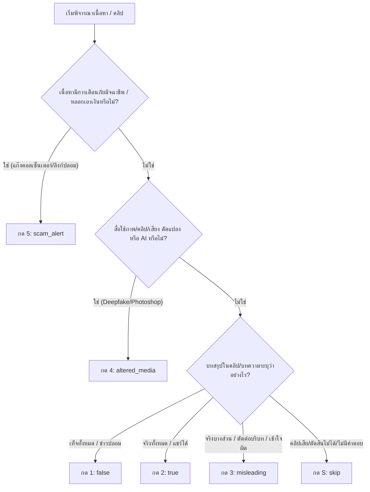

# คู่มือสำหรับผู้ตรวจสอบติดป้ายข้อมูล (Human Reviewer Guidelines)
**ระบบตรวจสอบและติดป้ายข้อเท็จจริง — `/review` Room**

> **เป้าหมาย:** เพื่อให้ผู้ตรวจสอบ (Human Reviewer) สามารถตัดสินและติดป้ายข้อมูลข้อเท็จจริงจากสื่อต่าง ๆ (คลิป Sure & Share, บทความ Cofact, Thai PBS ฯลฯ) ได้อย่างมีมาตรฐาน เดียวกัน ป้องกันความสับสน และสร้างชุดข้อมูล (Dataset) ที่แม่นยำสูงสำหรับสอน AI

---

## 1. ผังการตัดสินใจอย่างรวดเร็ว (Quick Decision Tree)

---

## 2. เกณฑ์การติดป้ายทั้ง 6 ป้าย (Label Criteria)

### 🔴 กด `1` : `false` (ไม่จริง / ข่าวปลอม)
* **นิยาม:** คำกล่าวอ้างนั้น **เป็นเท็จโดยสิ้นเชิง** ถูกกุขึ้นมา ไม่มีพยานหลักฐานหรือข้อเท็จจริงรองรับ
* **ตัวอย่าง:**
  * *"ดื่มน้ำมะนาวผสมโซดารักษามะเร็งหายขาดใน 3 วัน"* (ไม่เป็นความจริงตามหลักการแพทย์)
  * *"รัฐบาลประกาศยกเลิกวันหยุดสงกรานต์ปีนี้"* (ข่าวปลอมสิ้นเชิง)
* **จุดสังเกต:** ในคลิปหรือบทความสรุปชัดเจนว่า **"ไม่จริง"**, **"ข่าวปลอม"**, หรือ **"ห้ามแชร์"**

---

## 3. 🟢 กด `2` : `true` (จริง / แชร์ได้)
* **นิยาม:** คำกล่าวอ้างได้รับการยืนยันแล้วว่าเป็น **ความจริง** ข้อมูลถูกต้องตามหลักฐานและหน่วยงานที่เกี่ยวข้อง
* **ตัวอย่าง:**
  * *"กรมอุตุฯ เตือนพายุเข้าภาคเหนือวันที่ 15 นี้"* (ตรงตามประกาศจริง)
  * *"กระทรวงการคลังเปิดลงทะเบียนโครงการใหม่จริง"* (มีโครงการจริงตามระเบียบ)
* **จุดสังเกต:** บทความหรือคลิปสรุปว่า **"เรื่องจริง"**, **"จริง แชร์ได้"**, **"มีผลบังคับใช้จริง"**

---

## 4. 🟡 กด `3` : `misleading` (จริงบางส่วน / บิดเบือน / อย่าเพิ่งแชร์)
* **นิยาม:** มีส่วนที่เป็นความจริง แต่ถูกนำมา **ตัดต่อบริบท, พาดหัวเกินจริง, หรือตัดทอนข้อมูลสำคัญ** จนทำให้ผู้รับสารเข้าใจผิด
* **ตัวอย่าง:**
  * **ใช้รูปเก่าเล่าใหม่:** นำภาพน้ำท่วมเมื่อปี 2554 มาโพสต์ว่า "น้ำท่วมกรุงเทพฯ วันนี้" (รูปจริง แต่วันที่และสถานที่ผิดบริบท)
  * **จริงบางส่วน:** นโยบายผ่านความเห็นชอบหลักการแล้ว แต่โพสต์ว่า "เริ่มแจกเงินพรุ่งนี้ทันที" (เร่งรัดขั้นตอนเกินจริง)
  * **ตัดต่อคำพูด:** ตัดคลิปสัมภาษณ์เฉพาะบางประโยคทำให้ความหมายเปลี่ยน
* **จุดสังเกต:** คลิป/บทความสรุปว่า **"อย่าเพิ่งแชร์"**, **"จริงเพียงบางส่วน"**, **"ขาดบริบทสำคัญ"**, **"พาดหัวเกินจริง"**

---

## 5. 🔵 กด `4` : `altered_media` (ภาพ/คลิปดัดแปลง · AI)
* **นิยาม:** สื่อหลัก (ภาพ, เสียง, วิดีโอ) ถูก **ดัดแปลงทางเทคโนโลยี** เช่น Photoshop, Deepfake, ตัดต่อเสียงสังเคราะห์ (AI Voice Clone)
* **ตัวอย่าง:**
  * ภาพนายกรัฐมนตรีใส่ชุดที่ไม่เคยใส่จริง (สร้างด้วย Midjourney/DALL-E)
  * คลิปเสียงนักการเมืองพูดเรื่องเบ็ดเตล็ด (สร้างด้วย AI Voice Generator)
  * วิดีโอสลับใบหน้าบุคคล (Face Swap / Deepfake)
* **จุดสังเกต:** เน้นไปที่ **ตัวสื่อสิ่งบันทึกถูกปลอมแปลงด้วยเทคโนโลยี** ไม่ใช่แค่การเขียนข้อความเท็จ

---

## 6. 🟤 กด `5` : `scam_alert` (เตือนภัยมิจฉาชีพ)
* **นิยาม:** ข้อมูลเกี่ยวกับการ **หลอกลวงเอาทรัพย์สิน, แอปพลิเคชันดูดเงิน, ลิงก์ดูดข้อมูล, หรือการแอบอ้างเป็นหน่วยงาน/มิจฉาชีพ**
* **ตัวอย่าง:**
  * *"เพจปลอมแอบอ้างเป็นสรรพากร หลอกให้โหลดแอปส่งสรรพากร"*
  * *"SMS แจ้งว่าคุณได้รับเงินปันผล กดลิงก์เพื่อยืนยันตัวตน"*
  * *"แก๊งคอลเซ็นเตอร์อ้างเป็นตำรวจขู่โอนเงิน"*
* **เหตุผลที่แยกป้ายนี้:** เพื่อแยกแยะ **"ภัยคุกคามทางไซเบอร์/การหลอกลวง"** ออกจาก **"ข่าวปลอมทางการเมือง/สุขภาพ"** ทำให้ระบบสามารถแจ้งเตือนภัยมิจฉาชีพได้ตรงจุด

---

## 7. ⚪ กด `S` : `skip` (ข้าม / ตัดสินไม่ได้จากเนื้อหา)
* **นิยาม:** เมื่อไม่สามารถตัดสินได้จากข้อมูลที่มีอยู่
* **ใช้เมื่อ:**
  * คลิป YouTube ถูกลบ หรือขึ้นว่า `Video unavailable / Private`
  * บทความแสดงเนื้อหาไม่ครบถ้วน หรือมีเพียงส่วนหัวแต่ไม่มีเนื้อหาผลการตรวจ
  * เป็นคลิปคุยรายการยาวที่ไม่ได้สรุปผลชัดเจนว่า "จริง" หรือ "เท็จ"
* *(ข้อมูลที่กด Skip จะถูกบันทึกเป็น `human_skipped` เพื่อให้นักวิเคราะห์มาตรวจทานย้อนหลัง)*

---

## 3. ตารางแก้ข้อสงสัยกรณีคาบเกี่ยว (Edge Case Matrix)

| สถานการณ์ | เลือกป้ายไหน? | เหตุผล |
| :--- | :--- | :--- |
| **ภาพหลุด AI แอบอ้างเป็นดาราชวนลงทุนเทรดหุ้น** | `scam_alert` (หรือ `altered_media`) | หากเน้นเรื่อง **หลอกเงิน/มิจฉาชีพ** ให้prioritize `scam_alert` หากเน้นเรื่อง **ภาพ AI ดารา** เลือก `altered_media` |
| **ภาพข่าวจริง แต่เอามาใส่ข้อความโกหก** | `misleading` | ภาพไม่ได้ Photoshop แต่ถูกใช้ผิดบริบท/ใส่ข้อความบิดเบือน |
| **ภาพตัดต่อ Photoshop หัวคนใส่ตัวสัตว์** | `altered_media` | มีการดัดแปลงภาพเชิงเทคนิคชัดเจน |
| **เพจแจกเงินฟรี กดลิงก์ใต้คอมเมนต์** | `scam_alert` | เป็นพฤติกรรมมิจฉาชีพหลอกเอาข้อมูล/การโต้ตอบ |
| **คลิปตลก/เสียดสีการเมือง (Parody)** | `false` หรือ `misleading` | หากคนเชื่อว่าเป็นเรื่องจริงและสื่อสรุปว่าเป็นข่าวปลอม เลือก `false` |

---

## 4. ปุ่มลัดบนคีย์บอร์ด (Keyboard Shortcuts)

* <kbd>1</kbd> : **ไม่จริง / ข่าวปลอม** (`false`)
* <kbd>2</kbd> : **จริง / แชร์ได้** (`true`)
* <kbd>3</kbd> : **จริงบางส่วน / บิดเบือน** (`misleading`)
* <kbd>4</kbd> : **ภาพ/คลิปดัดแปลง · AI** (`altered_media`)
* <kbd>5</kbd> : **เตือนภัยมิจฉาชีพ** (`scam_alert`)
* <kbd>S</kbd> : **ข้าม** (`skip`)
* <kbd>U</kbd> : **ย้อนกลับ** (`undo`) หากกดปุ่มผิดในรายการที่แล้ว
