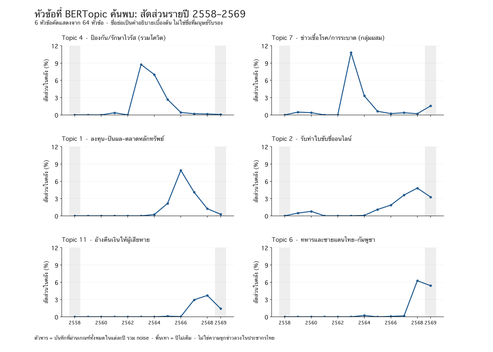
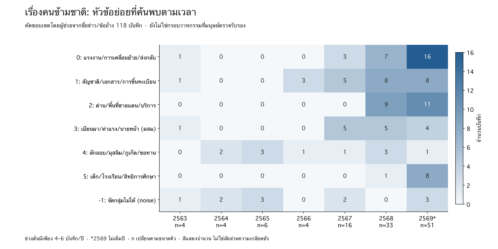

# ผล BERTopic และเส้นเวลาหัวข้อ — ชุดวิเคราะห์สำหรับนักข่าว

รันจริง 8 กันยายน 2569 บน snapshot เดิม (วันตัด 2 กันยายน 2569) ไม่ใช่ข้อมูลสดและไม่ใช่บทความพร้อมตีพิมพ์

ฐาน 14,429 บันทึก → ข้อความตรงกันทุกตัวอักษรไม่ซ้ำ 13,377 → BERTopic ค้นพบ 64 หัวข้อ; noise 2,324 บันทึก (16.11%) โดยไม่บังคับเข้า 10 หมวดเดิม

## อ่านกราฟเวลา

ชื่อไทยสั้น ๆ ในกราฟเป็นการตีความเบื้องต้นจากคำสำคัญและตัวอย่าง ไม่ใช่ชื่อที่ผู้เชี่ยวชาญตรวจครบ ทั้ง 64 หัวข้อพร้อมตัวแทนอยู่ใน [topics.csv](topics.csv); ทุกแถวเชื่อมรหัสข่าวและ URL ใน [assignments.csv](assignments.csv)

ดูครบทุกหัวข้อ: [Heatmap หน้า 1](all_topics_heatmap_1.png) และ [หน้า 2](all_topics_heatmap_2.png) ความเข้มในภาพนี้เทียบกับจุดสูงสุดของหัวข้อเดียวกัน ไม่ใช้เปรียบเทียบขนาดระหว่างหัวข้อ; สัดส่วนจริงรายปีอยู่ใน CSV

## ข้อค้นพบเรื่องแรก: ไม่ใช่แค่สุขภาพลด–การเงินเพิ่ม

| หัวข้อค้นพบ (คำอธิบายเบื้องต้น) | 2563–2564 | 2567–2568 |
|---|---:|---:|
| 4: ป้องกัน/รักษาไวรัส (รวมโควิด) | 193/2,465 (7.83%) | 9/4,836 (0.19%) |
| 7: ข่าวเชื้อโรค/การระบาด (กลุ่มผสม) | 169/2,465 (6.86%) | 14/4,836 (0.29%) |
| 1: ลงทุน–ปันผล–ตลาดหลักทรัพย์ | 3/2,465 (0.12%) | 129/4,836 (2.67%) |
| 2: รับทำใบขับขี่ออนไลน์ | 1/2,465 (0.04%) | 204/4,836 (4.22%) |
| 11: อ้างคืนเงินให้ผู้เสียหาย | 0/2,465 (0.00%) | 161/4,836 (3.33%) |
| 6: ทหารและชายแดนไทย–กัมพูชา | 3/2,465 (0.12%) | 156/4,836 (3.23%) |

ที่มา [ตารางเปรียบเทียบและความไว](editorial_period_comparisons.csv) หัวข้อค้นพบไม่เท่ากับกฎ T01–T10 เดิม ห้ามใช้รหัสสลับกัน

สิ่งที่เพิ่มจากการนับคำค้นคือกลุ่มรับทำใบขับขี่ออนไลน์และกลุ่มอ้างคืนเงินผู้เสียหายที่ปรากฏเป็นหัวข้อแยก รวมถึงการแยกข่าวโควิดออกเป็นข้ออ้างรักษา/ป้องกัน ข่าวพบผู้ติดเชื้อ และวัคซีน ไม่ควรเหมารวมว่ามีเส้นทางเดียวกันทั้งหมด

การตรวจตัวอย่างพบ Topic 4 มีข้ออ้างขับไวรัสด้วยน้ำร้อนปี 2561 (ID 25714) และ Topic 7 มีไข้เลือดออกปี 2560 รวมถึงข่าวอาหารที่ใช้คำระบาดปี 2559 จึงใช้ชื่อกลุ่มกว้าง ไม่เรียกทุกแถวว่าโควิด และต้องตรวจความบริสุทธิ์ของหัวข้อก่อนตีพิมพ์

กลุ่มลงทุน Topic 1 เพิ่มเมื่อเทียบสองช่วง แต่รายปีลดจาก 99 บันทึก (4.11%) ใน 2567 เป็น 30 (1.24%) ใน 2568 จึงไม่ควรเขียนว่าเติบโตต่อเนื่องทุกปี หรือเหมารวมเป็นการลงทุนทุกชนิด

Topic 0 ใหญ่มาก (5,292 บันทึก) และยังผสมสุขภาพ/อาหาร/การรักษาหลายเรื่อง เป็นข้อจำกัดของความละเอียดโมเดล ส่วนอันดับการเปลี่ยน 2567→2568 มี noise เพิ่มเป็นตัวขับสำคัญ ไม่ควรตีความว่าเกิดวาทกรรมใหม่เพียงอย่างเดียว

ข้อจำกัดที่ตรวจพบหลัง fit: 82 บันทึกยังตรงคำที่อาจเป็นคำเฉลย/คำเตือนตกค้าง ดู [คิวตรวจข้อความ](residual_editorial_review.csv) โดย Topic 54 มีตัวอย่างจัดกลุ่มตามสำนวนแก้ข่าวมากกว่าหัวข้อข่าว จึงห้ามเขียนว่าได้ 64 หัวข้อบริสุทธิ์ที่ยืนยันแล้ว ผลนี้เป็น exploratory run ไม่ใช่ taxonomy พร้อมตีพิมพ์

ทดสอบตัด 82 บันทึกที่ตรงคำเตือนแล้ว fit UMAP/HDBSCAN ใหม่จริง: เหลือ 14,347 บันทึก ได้ 56 กลุ่ม (ARI เทียบรอบหลัก 0.848) กลุ่มที่จับคู่กับหัวข้อคัดแสดงทั้งหกยังมีทิศทางต้นช่วง→ปลายช่วงเหมือนเดิม แต่ขอบเขตและขนาดเปลี่ยน เช่นกลุ่มชายแดนมี Jaccard เพียง 0.370 จึงไม่ควรยืนยันจำนวนกลุ่มหรือขนาดผลว่าเสถียร ดู [ตารางทดสอบคำเฉลยตกค้าง](leakage_exclusion_sensitivity.csv) และ [รายละเอียด](leakage_sensitivity_metrics.json) การตัดคำเตือนเป็น sensitivity ไม่ใช่การรับรองว่าทุกแถวที่ตัดผิดหรือทุกแถวที่เหลือสะอาด

## เรื่องที่สอง: หัวข้อย่อยซ้อนกัน ไม่ได้ยืนยันสามยุค

ค้นขยายด้วยความหมายได้คิว 332 บันทึก จากนั้นผู้ช่วยอ่านชื่อข่าว/ข้ออ้างและเสนอคัดเข้า 118 บันทึก (บริบทผู้อยู่อาศัย/แรงงาน/สถานะ 99; คนและบริการข้ามแดน 19), กำกวม 7, เสนอคัดออก 207 ทุกการตัดสินอยู่ใน [แฟ้มตรวจขอบเขต](migrant_scope_decisions.csv) และรอนักข่าวตรวจต้นทาง

โมเดลย่อยค้นพบ 6 หัวข้อและ noise 11 บันทึก ชื่อกลุ่มเป็นหัวข้อผสม ไม่ใช่การรับรองกรอบโจมตี/ความเกลียดชัง โดยเฉพาะกลุ่มเอกสารรวมใบขับขี่ด้วย และกลุ่มเมียนมาผสมค่าแรงกับนายหน้า

เบาะแสสำคัญ: กลุ่มการศึกษา (subtopic 5) มี 1 บันทึกใน 2568 และ 8 ใน 2569; กลุ่มลักลอบ/มุสลิม/ภูเก็ต (subtopic 4) พบตั้งแต่ 2564 และยังพบใน 2569 ขณะที่กลุ่มสัญชาติ/เอกสารมีตัวอย่างตั้งแต่ 2563 ดังนั้นอย่าเขียนว่าสิทธิเพิ่งปรากฏหลังปี 2568

ข้ออ้างปลดล็อก 5 อาชีพที่กลับมาหลายปีถูกจัดเป็น noise ในโมเดลย่อย แสดงว่าข่าวที่นักข่าวเห็นคุณค่าอาจไม่กลายเป็นคลัสเตอร์ โมเดลไม่พบคลัสเตอร์โรคแยกก็ไม่ได้พิสูจน์ว่ากรอบโรคไม่เคยมีอยู่

ข้อควรระวังเพิ่มเติมจากโมเดลใหญ่: Topic 28 เพิ่มในสัดส่วนรวมสองช่วง แต่เมื่อให้น้ำหนักสามสำนักที่เทียบได้เท่ากัน ผลต่างเหลือประมาณ +0.033 จุดเปอร์เซ็นต์ (p เชิงสำรวจ 0.960) จึงไม่มีหลักฐานจากการทดสอบนี้ให้กล่าวว่ากลุ่มแรงงาน/ส่งกลับเพิ่มโดยไม่เกี่ยวกับส่วนผสมสำนัก

[หัวข้อย่อยและตัวแทน](migrant_screened_topics.csv) · [ทุกข่าวพร้อมหัวข้อย่อย](migrant_screened_assignments.csv) · [เส้นเวลาสองขอบเขต](migrant_screened_timeline.csv) · [คำสำคัญรายปี](migrant_screened_words_over_time.csv)

## วิธีวิจัยและข้อจำกัด

1. ใช้เวกเตอร์ E5 เดิมเฉพาะข้อความตรงกันทุกตัวอักษร 13,154 ข้อความ และเข้ารหัสเพิ่ม 223 ผ่าน `th_verify.search.build_index` นำหน้าด้วย passage และทำ L2 normalization; ไม่แก้ SQLite

2. UMAP 10 มิติ (cosine, neighbors=15, seed=42) แล้ว HDBSCAN min_cluster_size=30/min_samples=5; ทดลองขนาด 15/30/50/80 ได้ 161/64/43/33 กลุ่มตามลำดับ จำนวน 64 จึงเป็นผลของพารามิเตอร์ ไม่ใช่จำนวนหัวข้อจริงในสังคม

3. BERTopic 0.17.4 ใช้ภาษา multilingual และตัดคำไทย newmm ก่อน c-TF-IDF คำนวณหัวข้อร่วมครั้งเดียวและคำสำคัญรายปีด้วย topics_over_time โดยปิด smoothing ทั้งสองแบบ เพื่อไม่ทำให้เส้นเวลาเนื้อหาดูเรียบเกินหลักฐาน [เอกสารวิธี](https://maartengr.github.io/BERTopic/getting_started/topicsovertime/topicsovertime.html)

4. นับคืนทุกบันทึกตามวันเผยแพร่บทตรวจสอบ ไม่ใช่วันที่โพสต์ลวงครั้งแรก เก็บ noise ในตัวหาร แยกสำนักและทดสอบตัดข้อความซ้ำสำนัก–ปี/ผล false ไว้ในตาราง ช่วงต้นและปี 2569 ไม่เต็มปี

5. [Jensen–Shannon distance](adjacent_year_shifts.csv) คือระยะห่างองค์ประกอบระหว่างปี รวม noise ไม่ใช่การยืนยัน change point หรือสาเหตุ อันดับแรกคือ 2562→2563 (0.4903); อันดับสอง 2567→2568 (0.3702)

6. [Permutation](source_balanced_tests.csv) 2,000 รอบ ใช้จำนวนต้น/ปลายจริงภายในแต่ละสำนักที่มีอย่างน้อย 20 บันทึกทั้งสองช่วง (AFNC, AFP, ชัวร์ก่อนแชร์) เฉลี่ยส่วนต่างโดยให้น้ำหนักสำนักเท่ากัน p=(exceed+1)/2001 แล้ว BH-FDR ทุกหัวข้อรวม noise ผลเป็น exploratory: ยังไม่แก้การพึ่งพากันของข้ออ้างซ้ำ/เวลาและความไม่แน่นอนของการเลือกโมเดล จึงไม่เรียกว่าเป็นหลักฐานยืนยันระดับประเทศ

7. โมเดลย่อยใช้ขอบเขตที่ผู้ช่วยคัดจากข้อความ ไม่ใช่ผู้เชี่ยวชาญตรวจเต็มบท ใช้ UMAP 5 มิติ + HDBSCAN leaf (8/3) เพื่อหากลุ่มละเอียด พร้อม [การทดลองพารามิเตอร์](migrant_screened_sensitivity.csv) การเพิ่มคิวเป็น top-200 เพื่อนบ้านของ seed ไม่ใช่ threshold ความเกี่ยวข้องที่ผ่าน validation

8. แยกหัวข้อออกจากกรอบเรื่องเล่า/เจตนา: ช่อง human_frame ยังคงว่าง ต้องตรวจหลักฐานเรื่องผู้ร้าย ผู้เสียหาย และการเรียกร้องสิทธิในข้อความจริง การนับ [ข้อความกลับมาข้ามปี](recurring_text_families.csv) ไม่ใช่การอ้างว่าค้นพบแม่แบบโน้มน้าวใจที่ตรวจแล้ว

9. ยังมีความเสี่ยงข้อความสกัดขาด/คำเฉลยตกค้างในฐาน เช่น ID 15735 และบางข้อความจาก LLM; ตัวแทนคือข่าวใกล้ centroid ใน E5 เดิม ไม่ใช้ตำแหน่งภาพ 2D/3D เป็นหลักฐาน ไม่มีการตรวจ benchmark ความแม่นหัวข้อกับผู้เชี่ยวชาญในรอบนี้

## ใช้งานต่อ

[โครงเรื่อง 1 ฉบับใช้ผลโมเดล](story_1_model_outline_th.md) · [โครงเรื่อง 2 ฉบับใช้ผลโมเดล](story_2_model_outline_th.md)

รันจากรากโครงการ: `.venv/bin/python scripts/discovered_timeline.py` แล้ว `.venv/bin/python scripts/migrant_discovered_review.py` และ `.venv/bin/python scripts/render_discovered_timeline.py` เก็บรุ่นแพ็กเกจและพารามิเตอร์ใน [config.json](config.json) และ [metrics.json](metrics.json); อย่าใช้โฟลเดอร์รันเดิมกับ snapshot ใหม่

รันทดสอบคำเฉลยตกค้างเพิ่มด้วย `.venv/bin/python scripts/check_discovery_leakage.py` ก่อนสร้างรายงาน แพ็กเกจที่ใช้จริงตรึงไว้ใน [requirements-topic-analysis.txt](../../requirements-topic-analysis.txt) กรอกงานตรวจของนักข่าวในสำเนาแยก; สคริปต์สร้างไฟล์อนุพันธ์ใหม่และไม่ควรรันเขียนทับงานตรวจที่กรอกแล้ว

[ผลตรวจข้อมูลและกราฟ](VERIFICATION.md): ผ่าน 23 ข้อรวมชุดก่อนหน้า; รอบโมเดลนี้โดยเฉพาะ 8 ข้อ

สถานะ: ผลสำรวจจากโมเดลพร้อมตรวจต่อ ไม่ใช่ผลวาทกรรมที่มนุษย์รับรองหรือบทความพร้อมตีพิมพ์
