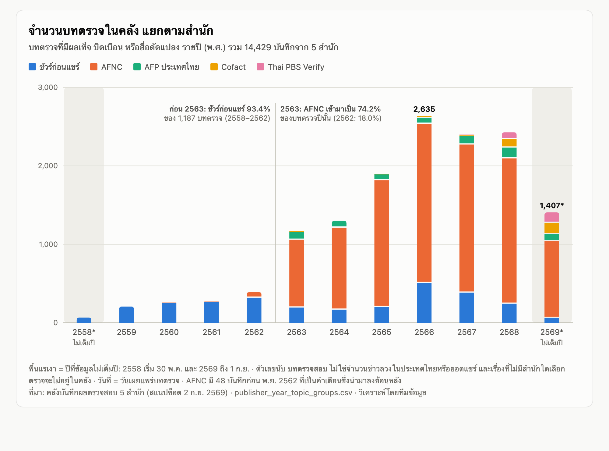
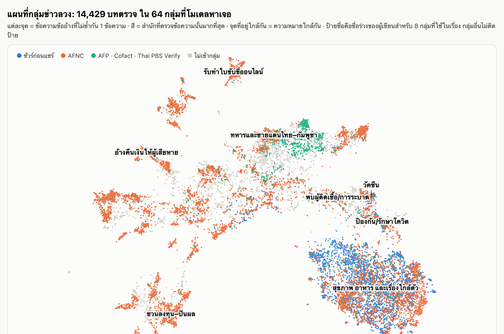
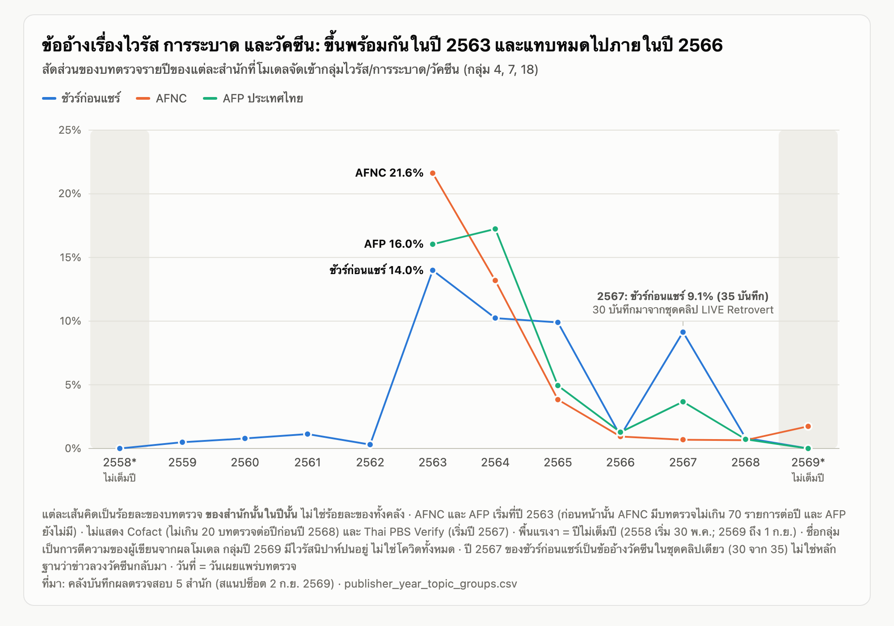
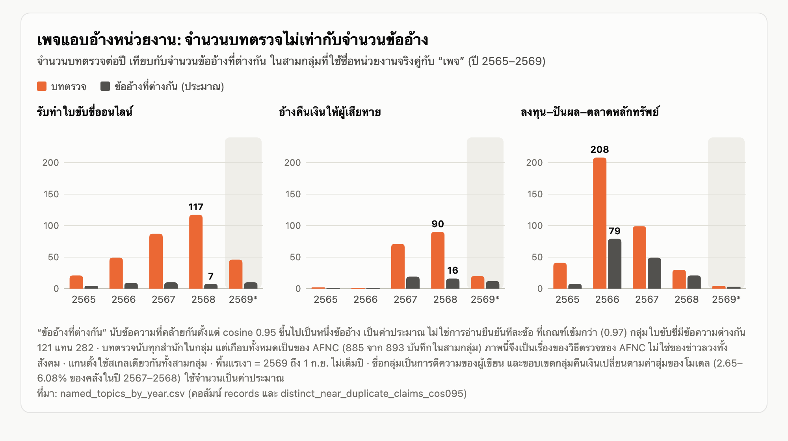

# 11 ปีในคลังตรวจข่าวลวงไทย: เราเห็นข่าวลวงเปลี่ยน หรือเห็นคนตรวจเปลี่ยน

> **สถานะ: ต้นฉบับสำหรับเจ้าของงานเรียบเรียงต่อ (ฉบับบทความยาว) ยังไม่พร้อมตีพิมพ์**
> เรียบเรียงจาก[ร่างทำงานฉบับที่ 2](story_1_draft_th.md) ซึ่งผ่านการตรวจทั้งกระบวนการแล้ว ตัวเลขทุกตัวมีที่มาในตารางท้ายร่างทำงาน
> เครื่องหมาย **【เติม】** = ต้องได้จากการสัมภาษณ์หรือลงพื้นที่ ไม่มีคำพูด ตัวบุคคล หรือฉากที่แต่งขึ้นในต้นฉบับนี้ **【ตรวจ】** = เปิดต้นทางยืนยันก่อนตีพิมพ์
> ชื่อกลุ่มหัวข้อ เช่น “สุขภาพ อาหาร และเรื่องใกล้ตัว” เป็นการตีความของผู้เขียนจากผลโมเดลและตัวอย่าง ยังไม่มีคนอ่านยืนยันครบ

**โปรย:** ผลตรวจสอบข่าวกว่า 14,000 รายการจาก 5 สำนักตลอด 11 ปี ไม่ได้เล่าเรื่องเดียว ห้าปีแรกเป็นรายการโทรทัศน์รายการเดียวที่ไล่แก้ความเชื่อเรื่องสุขภาพ ปี 2563 โรคระบาดเป็นเรื่องเดียวที่ทุกสำนักเห็นตรงกัน และตั้งแต่ปี 2565 ศูนย์ต่อต้านข่าวปลอมตรวจเพจปลอมที่อ้างชื่อหน่วยงานทีละเพจนับร้อยครั้ง คำถามที่ตามมาคือ เราเห็นข่าวลวงเปลี่ยน หรือเห็นคนตรวจเปลี่ยน

---

## 1. สองคำถาม ห่างกันเกือบสิบปี

**【เติม — ฉากเปิดที่ดีที่สุด】** หาคนจริงหนึ่งคนที่เคยเจอเพจอ้างรับทำใบขับขี่ หรือเพจอ้างคืนเงินให้ผู้ถูกหลอก (ผ่านผู้ตรวจข่าว เจ้าหน้าที่รับเรื่องร้องเรียน หรือเครือข่ายผู้เสียหาย) ต้องได้ความยินยอมเป็นลายลักษณ์อักษร และถามว่าเห็นเพจนั้นจากช่องทางใด อะไรในหน้าเพจทำให้เชื่อว่าเป็นหน่วยงานจริง แล้วทำอะไรต่อ ถ้าได้ ให้ใช้ฉากนั้นแทนสองย่อหน้าถัดไป ถ้าไม่มี อย่าสร้างตัวละครขึ้นมาแทน ใช้ฉากจากเอกสารด้านล่างนี้

วันที่ 30 สิงหาคม 2558 รายการชัวร์ก่อนแชร์เผยแพร่ตอนที่ตั้งคำถามว่า “โซดาล้างฟอร์มาลินออกจากอาหารทะเลได้จริงหรือ?” เป็นคำถามเรื่องในครัว ของที่ซื้อมาจากตลาด และสิ่งที่ผู้ชมอาจกำลังจะเอาเข้าปาก

ราวเก้าปีครึ่งต่อมา วันที่ 25 กุมภาพันธ์ 2568 ศูนย์ต่อต้านข่าวปลอม หรือ AFNC เผยแพร่ผลตรวจข้อความที่อ้างว่าสำนักงานป้องกันและปราบปรามการฟอกเงิน (ปปง.) เปิดให้ผู้เสียหายจากแก๊งคอลเซ็นเตอร์ “ลงทะเบียนรับเงินคืนผ่านเพจเฟซบุ๊ก” ข้ออ้างนี้ไม่ได้เล็งไปที่ใครก็ได้ มันเล็งไปที่คนที่เพิ่งถูกหลอกมาหนึ่งรอบแล้ว และกำลังหาทางเอาเงินคืน

ทั้งสองเรื่องอยู่ในคลังข้อมูลเดียวกัน แต่มาจากผู้ตรวจคนละราย ที่สนใจคนละเรื่อง นั่นคือประเด็นของบทความนี้

**【ตรวจ】** เปิดคลิป ID 26629 ([ชัวร์ก่อนแชร์ 30 ส.ค. 2558](https://www.youtube.com/watch?v=-FoCOP2LmRI)) และบทตรวจ ID 4795 ([AFNC 25 ก.พ. 2568](https://www.antifakenewscenter.com/?p=68536)) เก็บภาพหน้าจอพร้อมวันที่ ยืนยันชื่อตอน ถ้อยคำข้ออ้าง และข้อสรุปของผู้ตรวจ ต้นฉบับนี้จงใจไม่เขียนว่าตอนปี 2558 “ได้ผลว่าเท็จ” เพราะผลของรายการในคลังเป็นของทีมข้อมูลลง ไม่ใช่ป้ายที่รายการประกาศเอง วันที่ในคลังคือวันเผยแพร่บทตรวจ ไม่ใช่วันที่ข้ออ้างเริ่มแพร่

---

## 2. เรามองผ่านหน้าต่างของใคร

ข้อมูลที่ใช้คือบันทึกผลตรวจสอบข่าวจาก 5 สำนัก ที่มีผลว่า “เท็จ” “บิดเบือน” หรือ “สื่อดัดแปลง” รวม 14,429 บันทึก (เท็จ 11,899 บิดเบือน 2,465 สื่อดัดแปลง 65) ระหว่าง 30 พฤษภาคม 2558 ถึง 1 กันยายน 2569

ตัวเลขนี้นับ **บทตรวจสอบ** ไม่ใช่จำนวนข่าวลวงในประเทศไทย ไม่ใช่ยอดแชร์ และไม่ใช่ความเชื่อของสังคม เรื่องที่ไม่มีสำนักใดเลือกมาตรวจ ไม่ปรากฏในคลังนี้เลย

| สำนัก | บันทึก | สัดส่วน | บันทึกแรกในคลัง |
|---|---:|---:|---|
| ศูนย์ต่อต้านข่าวปลอม (AFNC) | 10,356 | 71.8% | มีจำนวนมากเริ่มปี 2563* |
| ชัวร์ก่อนแชร์ | 2,861 | 19.8% | 30 พ.ค. 2558 |
| AFP ประเทศไทย | 690 | 4.8% | 29 ม.ค. 2563 |
| Cofact | 284 | 2.0% | 17 มิ.ย. 2563 |
| Thai PBS Verify | 238 | 1.6% | 7 ต.ค. 2567 |

*AFNC มี 48 บันทึกที่ลงวันที่ก่อนพฤศจิกายน 2562 เป็นคำเตือนของหน่วยงานที่นำมาลงย้อนหลัง จึงไม่ควรเขียนว่าศูนย์ฯ ตรวจข่าวมาตั้งแต่ปี 2560

ตารางนี้ซ่อนข้อเท็จจริงที่สำคัญที่สุดของเรื่อง: **คลังนี้เป็นสองคลังต่อกัน** ระหว่างปี 2558–2562 มี 1,187 บันทึก หรือ 8.2% ของทั้งหมด และ 93.4% ของจำนวนนั้นมาจากชัวร์ก่อนแชร์รายการเดียว พอถึงปี 2563 สัดส่วนของ AFNC กระโดดจาก 18.0% เป็น 74.2% และตั้งแต่นั้นทุกปีอยู่ระหว่าง 69.6% ถึง 85.0%

ผลของรอยต่อนี้ร้ายแรงกว่าที่คิด ถ้านำทุกสำนักมารวมเป็นเส้นเดียว จะเห็นกลุ่มสุขภาพและอาหาร “ลดลงจาก 75.6% เหลือ 40.1%” ภายในปีเดียว ฟังเหมือนการเปลี่ยนครั้งใหญ่ของข่าวลวงไทย แต่เมื่อดูเฉพาะชัวร์ก่อนแชร์ กลุ่มเดียวกันลดจาก 88.7% เป็น 75.6% เท่านั้น ส่วนต่างที่เหลือไม่ใช่ข่าวลวงสุขภาพที่หายไป แต่เป็นผู้ตรวจรายใหม่ที่สนใจเรื่องอื่นเดินเข้ามาในคลัง บทความนี้จึงเล่าทีละสำนัก ไม่ลากเส้นเดียวข้ามปี 2562–2563 (ภาพที่ 1)

*ภาพที่ 1 — จำนวนบทตรวจในคลัง แยกตามสำนัก รายปี (พ.ศ.) พื้นแรเงาคือปี 2558 และ 2569 ซึ่งไม่เต็มปี ฉบับโต้ตอบ: [chart_records_by_publisher.html](../20261007_story1_viz_v001/chart_records_by_publisher.html) · ข้อมูล: [records_by_publisher_year.csv](../20261007_story1_viz_v001/records_by_publisher_year.csv)*

**ผลตรวจมาจากใคร** ต้องบอกผู้อ่านตรง ๆ บันทึกของ AFNC, AFP และ Thai PBS Verify ใช้ผลที่สำนักเองประกาศ (11,267 บันทึก) ส่วนชัวร์ก่อนแชร์และ Cofact ไม่มีป้ายผลให้ดึงเป็นข้อมูล ผู้ตรวจในทีมข้อมูลสองคนจึงเป็นผู้ลงผลจากเนื้อหารายการหรือบทความ รวม 3,162 บันทึก หรือ 21.9% ของคลัง ดังนั้นกับสองสำนักนี้ ห้ามเขียนว่า “สำนักตัดสินว่าเท็จ”

**【ตรวจ — ป้ายผลของทีมข้อมูล】** ใน 3,162 บันทึกนั้น 1,207 บันทึกเครื่องเสนอจากบทถอดเสียงแล้วคนยืนยัน และ 877 บันทึกไม่มีหลักฐานประกอบเลย (ไม่มีคำบรรยายและไม่มีบทถอดเสียง ส่วนใหญ่เป็นคลิปสั้นที่ชื่อตอนเป็นคำถาม) ถูกลงผลด้วยเวลากลาง 13.6 วินาทีต่อรายการ ขณะที่คลิปยาว 37–59 วินาที การเทียบภายในพบว่าป้ายที่ลงจากชื่อตอนถูกป้ายที่มีหลักฐานแย้งเพียง 2 จาก 166 กรณี แต่ยังควรสุ่มดูคลิปจริงราว 40 รายการ เพื่อให้มีตัวเลขความแม่นยำที่อ้างได้

**เครื่องมือจัดกลุ่ม** ทีมข้อมูลไม่ได้แบ่งหมวดด้วยมือ แต่ใช้โมเดล BERTopic จัดกลุ่มข้อความข้ออ้างตามความหมาย ที่การตั้งค่าหลัก โมเดลแยกได้ 64 กลุ่ม และมี 2,324 บันทึก (16.11%) ที่ไม่เข้ากลุ่มใด แต่ 64 ไม่ได้แปลว่าข่าวลวงไทยมี 64 ประเภท เมื่อปรับเกณฑ์ขนาดกลุ่มขั้นต่ำเป็น 15, 50 หรือ 80 บันทึก โมเดลให้ 161, 43 และ 33 กลุ่มตามลำดับ กลุ่มที่ใหญ่ที่สุดกลุ่มเดียวมี 5,292 บันทึก และรวมเรื่องสุขภาพ อาหาร และเรื่องใกล้ตัวไว้ด้วยกัน บทความนี้ใช้โมเดลเป็นแผนที่ ไม่ใช่เครื่องนับประเภท (ภาพที่ 2)

*ภาพที่ 2 — แผนที่กลุ่มข่าวลวง ทุกจุดคือข้อความข้ออ้างที่ไม่ซ้ำกัน 1 ข้อความ (13,377 ข้อความจาก 14,429 บทตรวจ) จุดใกล้กัน = ความหมายใกล้กัน ตำแหน่งเป็นการฉายภาพ 2 มิติเพื่อแสดงผล แกนไม่มีหน่วย ป้ายชื่อเป็นชื่อร่างของผู้เขียนสำหรับ 8 กลุ่ม ฉบับโต้ตอบที่ซูม ค้นหา และอ่านข้อความทีละจุดได้: [cluster_explorer.html](../20261007_cluster_explorer_v001/cluster_explorer.html)*

**【เติม — เสียงบรรณาธิการ ควรอยู่ต้นเรื่อง】** ถามบรรณาธิการหรือผู้ดูแลคลังของ AFNC และชัวร์ก่อนแชร์: เลือกข่าวมาตรวจจากอะไร (ร้องเรียน ยอดแชร์ คำขอของหน่วยงาน เฝ้าระวังเอง) ภารกิจของสำนักกำหนดให้สนใจเรื่องประเภทใด และมีเรื่องประเภทใดที่ไม่ตรวจ เปลี่ยนกำลังคน ภารกิจ หรือรูปแบบการเผยแพร่เมื่อไร และมีปีใดที่คลังออนไลน์ไม่ครบหรือถูกย้ายหรือลบ

---

## 3. ห้าปีแรก: รายการเดียว ความสนใจเดียว

ชัวร์ก่อนแชร์เป็นสำนักเดียวที่อยู่ในคลังครบทุกปี และเป็นแทบทั้งหมดของห้าปีแรก ชื่อตอนในช่วงนั้นบอกลักษณะของรายการได้ดี — “โซดาล้างฟอร์มาลินออกจากอาหารทะเลได้จริงหรือ?” (30 ส.ค. 2558), “ระวังโรคฉี่หนูในพริกแห้ง-ฝากระป๋องอาหาร จริงหรือ?” (21 ธ.ค. 2560), “14 สรรพคุณ ‘หนานเฉาเหว่ย’ (ป่าช้าเหงา) จริงหรือ ?” (4 ก.ย. 2561)

โมเดลจัด 2,486 จาก 2,861 บันทึกของรายการ (86.9%) ไว้ในกลุ่มใหญ่กลุ่มเดียว คือสุขภาพ อาหาร และเรื่องใกล้ตัว และสัดส่วนนี้แทบไม่ขยับตลอดสิบเอ็ดปี

| ปี | บันทึกของรายการ | สุขภาพ อาหาร เรื่องใกล้ตัว | ไวรัส/การระบาด/วัคซีน |
|---|---:|---:|---:|
| 2558* | 65 | 83.1% | 0.0% |
| 2559 | 206 | 72.8% | 0.5% |
| 2560 | 254 | 86.2% | 0.8% |
| 2561 | 265 | 91.7% | 1.1% |
| 2562 | 319 | 88.7% | 0.3% |
| 2563 | 193 | 75.6% | 14.0% |
| 2564 | 166 | 78.9% | 10.2% |
| 2565 | 202 | 82.7% | 9.9% |
| 2566 | 506 | 94.7% | 1.0% |
| 2567 | 383 | 84.1% | 9.1% |
| 2568 | 242 | 97.1% | 0.8% |
| 2569* | 60 | 95.0% | 0.0% |

*ไม่เต็มปี

สิ่งเดียวที่แทรกเข้ามาในความสนใจของรายการคือโรคระบาด (ส่วนถัดไป) ไม่มีปีใดที่รายการหันไปตรวจเพจแอบอ้างหน่วยงาน หรือการหลอกลงทุนอย่างที่จะเห็นใน AFNC

**หลังปี 2565 ตัวเลขของรายการเปลี่ยนความหมาย** บันทึกที่เป็นคลิปสั้นแนวตั้ง (#shorts) มี 43 จาก 202 ในปี 2565 (21%) แล้วเพิ่มเป็น 391 จาก 506 ในปี 2566 (77%) 250 จาก 383 ในปี 2567 (65%) และ 172 จาก 242 ในปี 2568 (71%) วันที่ในคลังของคลิปเหล่านี้คือวันเผยแพร่คลิปสั้น ยอดที่พุ่งขึ้นในปี 2566 จึงสะท้อนรูปแบบการเผยแพร่ใหม่ มากกว่าการตรวจข้ออ้างใหม่

หลักฐานอีกด้านอยู่ในข้อความที่ซ้ำกัน คลังมีข้อความที่ปรากฏตั้งแต่สองครั้งขึ้นไป 565 ชุด บางชุดห่างกันเกือบสิบปี เช่น “11 อาหารอันตราย ห้ามอุ่นซ้ำ” เผยแพร่ในเดือนกันยายน 2559 และอีกครั้งวันที่ 21 กรกฎาคม 2568 วันเดียวกับที่ “เติมน้ำมันเต็มถังเสี่ยงระเบิด” ซึ่งเคยเผยแพร่ในปี 2559 กลับมาเช่นกัน ทั้งสองครั้งเป็นของชัวร์ก่อนแชร์ และเป็นแบบนี้เกือบทั้งคลัง: 563 จาก 565 ชุดอยู่ในสำนักเดียวกันทั้งชุด ในจำนวนนั้น 33 ชุดห่างกันตั้งแต่ห้าปีขึ้นไป และไม่มีชุดใดข้ามสำนักเลย

สิ่งที่วนกลับมาในคลังจึงเป็น *คำแก้ข่าว* มากกว่าข่าวลือ ที่ใกล้เคียง “ข้ออ้างที่กลับมา” ที่สุดมีเพียง 2 ชุดที่สองสำนักตรวจแยกกัน:

- “เด็กติดเกม เสี่ยงเป็นโรคลมชัก” — AFNC สองครั้งในปี 2563 (16 ส.ค. และ 17 พ.ย.) และชัวร์ก่อนแชร์ 14 ม.ค. 2567
- “มะเร็งกระเพาะอาหารติดต่อได้ทางน้ำลาย” — ชัวร์ก่อนแชร์ 5 ก.ย. 2562, AFNC 6 ก.ย. 2563 และ 27 มี.ค. 2565

**【ตรวจ — อ่านตัวอย่างแล้ว】** กลุ่ม “สุขภาพ อาหาร และเรื่องใกล้ตัว” อ่านตัวอย่างสุ่ม 70 แถว (บรรณาธิการอ่านก่อน แล้ว AI อ่านซ้ำ ข้อที่ต่างกันตามผล AI ดู[ไฟล์เปรียบเทียบ](../../deliverables/story1_review/assistant_second_read.csv)): ตรงกลุ่ม 63 ไม่ตรง 5 (บ้าน รถ คลิปแปลก) ไม่แน่ใจ 2 คิดเป็น 93% ของแถวที่ตัดสินได้ (ช่วงความเชื่อมั่น 95%: 84–97%) จึงเขียนได้เพียงว่า “กลุ่มที่ราวเก้าในสิบเป็นเรื่องสุขภาพ อาหาร หรือร่างกาย” ไม่ใช่ “ทุกข้อ” ตัวเลข 86.9% ข้างบนเป็นสัดส่วนของ *กลุ่มโมเดล* ถ้าจะบอกสัดส่วนของ “เรื่องสุขภาพ” ต้องหักส่วนที่ไม่ตรงออก (ประมาณการราว 80% ช่วง 73–84% โดยสมมติว่าตัวอย่างสะท้อนแถวของชัวร์ก่อนแชร์) ต้องบอกผู้อ่านว่า AI ร่วมอ่านซ้ำ และให้เปิดคลิป ID 26629, 26026, 25785 รวมทั้งบทตรวจของสองชุดข้ามสำนัก ดูว่าอ้างโพสต์ต้นเหตุเดียวกันหรือคนละโพสต์ ถ้าเป็นโพสต์เดียวกัน ให้ถอดออกจากรายการ “ข้ามสำนัก”

**【เติม — ชัวร์ก่อนแชร์】** การนำตอนปี 2558–2560 มาทำคลิปสั้นในปี 2566–2568 เลือกจากอะไร มีคนถามเรื่องนี้เข้ามาใหม่ หรือเลือกจากคลังเพื่อผลิตคลิปสั้น และทำไมรายการจึงอยู่กับเรื่องสุขภาพมาตลอด

---

## 4. ปี 2563: เรื่องเดียวที่ทุกประตูเห็นพร้อมกัน

ถ้าจะมีแนวโน้มเดียวในคลังนี้ที่ผ่านการทดสอบทุกแบบ มันคือโรคระบาด

ปี 2563 เป็นปีเดียวที่สำนักซึ่งสนใจต่างกันขยับไปทางเดียวกัน ข้ออ้างเรื่องไวรัส การระบาด และวัคซีน ซึ่งแทบไม่มีในชัวร์ก่อนแชร์ก่อนหน้านั้น (0.3% ในปี 2562) ขึ้นเป็น 14.0% ของบันทึกของรายการในปี 2563 ใน AFNC กลุ่มเดียวกันคิดเป็น 21.6% (187 จาก 865) และใน AFP 16.0% (17 จาก 106) แล้วทั้งสามสำนักก็ลดลงพร้อมกัน (ภาพที่ 3)

| ปี | ชัวร์ก่อนแชร์ | AFNC | AFP |
|---|---:|---:|---:|
| 2563 | 14.0% | 21.6% | 16.0% |
| 2564 | 10.2% | 13.2% | 17.2% |
| 2565 | 9.9% | 3.8% | 4.9% |
| 2566 | 1.0% | 0.9% | 1.3% |

*ภาพที่ 3 — สัดส่วนของบทตรวจที่โมเดลจัดเข้ากลุ่มไวรัส/การระบาด/วัคซีน ของแต่ละสำนัก รายปี (ร้อยละของบทตรวจสำนักนั้นในปีนั้น) จุดนูนปี 2567 ของชัวร์ก่อนแชร์มาจากชุดคลิปเดียว ฉบับโต้ตอบ: [chart_virus_by_publisher.html](../20261007_story1_viz_v001/chart_virus_by_publisher.html) · ข้อมูล: [virus_share_by_publisher_year.csv](../20261007_story1_viz_v001/virus_share_by_publisher_year.csv)*

เพราะแนวโน้มนี้ปรากฏในแต่ละสำนักแยกกัน จึงเป็นข้อสรุปที่มั่นคงที่สุดของเรื่อง: ในคลังตรวจข่าวทุกแห่งที่มีข้อมูล ข้ออ้างเรื่องไวรัสและการระบาดขึ้นในปี 2563 และแทบหมดไปภายในปี 2566

แต่โมเดลไม่ได้เห็นโควิดเป็นก้อนเดียว มันแยกออกอย่างน้อยสามกลุ่มที่มีเส้นทางต่างกัน (จำนวนต่อไปนี้รวมทุกสำนัก)

**เส้นแรก คือข้ออ้างป้องกันและรักษา** ขึ้นสูงสุดในปี 2563 ที่ 102 บันทึก และ 91 ในปี 2564 เช่น “รับประทานไข่ต้มต้าน COVID-19” (AFNC, 27 มี.ค. 2563) หรือ “สูตรฆ่าเชื้อไวรัสโควิด-19 ด้วยการสูดไอน้ำสมุนไพร” (AFNC, 4 ก.ค. 2564) แล้วเหลือ 51 ในปี 2565 และ 11, 5, 4, 1 ในปี 2566–2569

สมาชิกเก่าที่สุดของกลุ่มนี้มาก่อนโควิด เดือนพฤศจิกายน 2561 ชัวร์ก่อนแชร์เผยแพร่ตอนเกี่ยวกับข้ออ้างว่าดื่มน้ำร้อนแล้วตามด้วยกาแฟร้อนจะขับเชื้อไวรัสออกทางปัสสาวะ คำสำคัญของกลุ่มในแต่ละปีเลื่อนไปเรื่อย ๆ ปี 2563 คือ “ต้าน ป้องกัน ฆ่าเชื้อ” ปี 2564 มี “กระชาย” และ “ผลิตภัณฑ์” ปี 2566 มี “CDS” และ “ล้างพิษ” ปี 2568 เหลือสูตรบ้าน ๆ อย่างยี่หร่าและมะนาว

สิ่งที่คลังพอให้ตั้งเป็นสมมติฐานได้คือ รูปแบบ “สูตรบ้านไล่เชื้อ” อาจคงที่ ส่วนชื่อโรคเป็นตัวแปร แต่ต้องเขียนให้ชัดว่าเป็นสมมติฐาน เพราะการที่โมเดลจัดข้อความไว้ใกล้กัน ยังไม่ใช่หลักฐานว่าข้อความถูกคัดลอกต่อกันมา

**เส้นที่สอง คือข้ออ้างว่าพบผู้ติดเชื้อ** มีรูปแบบของตัวเอง เช่น “พบผู้ติดเชื้อไวรัส COVID-19 ที่โรงพยาบาลแห่งหนึ่งย่านราษฎร์บูรณะ” (AFNC, 6 มี.ค. 2563) และ “พบชาวจีนติดเชื้อไวรัสโคโรนาหนึ่งราย รักษาตัวอยู่ที่ รพ. ย่านบางแค” (AFNC, 18 ก.พ. 2563) กลุ่มนี้มี 126 บันทึกในปี 2563 แล้วเหลือปีละ 5–9 บันทึกในปี 2566–2568

แล้วมันก็กลับขึ้นอีกครั้ง ในแปดเดือนแรกของปี 2569 กลุ่มนี้มี 22 บันทึก ส่วนใหญ่ไม่ใช่โควิด แต่เป็นไวรัสนิปาห์ ช่วงปลายมกราคมถึงกุมภาพันธ์ 2569 สามสำนักตรวจข้ออ้างแบบเดียวกัน — “พบชาวอินเดีย 7 คน ติดเชื้อไวรัสนิปาห์ กักตัวที่โรงพยาบาล…” (AFNC, 28 ม.ค.), “ไทยติดไวรัสนิปาห์แล้ว 6 ราย” (AFNC, 2 ก.พ.) และ “ไวรัสนิปาห์ ถึงไทยแล้ว พบเคสผู้ป่วยที่ รพ.ศิริราช 1 ราย และจันทบุรี 6 ราย” (Thai PBS Verify, 16 ก.พ.) ไวรัสเปลี่ยน แต่แบบฟอร์ม “พบผู้ป่วยที่โรงพยาบาลชื่อจริง” ยังอยู่

**เส้นที่สาม คือข้ออ้างเรื่องวัคซีน** ขึ้นสูงสุดในปี 2564 (36 บันทึก) และดูเหมือนกลับมาในปี 2567 (38 บันทึก) แต่ 30 จาก 38 บันทึกนั้นอยู่ในชุดคลิป “ชัวร์ก่อนแชร์ LIVE Retrovert” ซึ่งมี 55 บันทึกเกือบทั้งหมดในปี 2567 ตัวเลข 9.1% ของชัวร์ก่อนแชร์ในปี 2567 ที่เห็นในตารางส่วนที่ 3 จึงมาจากชุดคลิปนี้เป็นส่วนใหญ่ (30 จาก 35 บันทึก) ไม่ใช่หลักฐานว่าข่าวลวงวัคซีนกลับมา ทิศทางของกลุ่มวัคซีนยังต่างกันระหว่างสำนักด้วย (AFNC ลด ชัวร์ก่อนแชร์เพิ่ม) ข้อสรุปที่ถูกต้องคือ ข้อมูลชุดนี้บอกทิศทางของข้ออ้างวัคซีนไม่ได้

**【ตรวจ】**
- คลิป ID 25714 ([ชัวร์ก่อนแชร์ 13 พ.ย. 2561](https://www.youtube.com/watch?v=ZOqEi5Oxw4I)) ข้อความข้ออ้างในคลังสกัดโดย LLM ต้องถอดคำพูดจริงจากคลิปก่อนอ้าง ถ้าไม่พบถ้อยคำร่วมกับข้ออ้างปี 2563–2564 ให้เขียนเพียงว่า “ข้ออ้างแนวเดียวกันมีมาก่อนโควิด”
- ID 1595, 1548, 26819 และ 28030 (Cofact, 2 ก.พ. 2569) ยืนยันกับบทตรวจต้นทาง และตรวจสถานการณ์นิปาห์จริงในไทยช่วงนั้นจากกรมควบคุมโรค กลุ่มปี 2569 ยังมีข้ออ้าง HIV ปะปน ห้ามเขียนว่าทั้ง 22 บันทึกเป็นนิปาห์
- ผลอ่านตัวอย่างกลุ่มไวรัส (30 แถวต่อกลุ่ม): “ป้องกัน/รักษา” ตรง 25 จาก 30 (83%; ช่วง 66–93%) ที่เหลือเป็นเรื่องผลหลังติดเชื้อ การแพร่เชื้อ และการตรวจ จึงอย่าเรียกว่า “ป้องกันและรักษา” ล้วน ๆ ให้เรียกว่า “ข้ออ้างเรื่องโควิดเกี่ยวกับการป้องกัน การรักษา และเรื่องเกี่ยวเนื่อง” หรือบอกว่าจำนวนอาจสูงเกินจริงราวหนึ่งในหก “พบผู้ติดเชื้อ” ตรง 25 จาก 28 ที่ตัดสินได้ (89%) ที่เหลือเป็นมาตรการและผลทดลอง “วัคซีน” ตรง 30 จาก 30
- กลุ่ม “พบผู้ติดเชื้อ” เป็นกลุ่มผสม

**【เติม — นักวิชาการพฤติกรรม/สื่อ】** ข้ออ้าง “สูตรบ้าน” และ “พบผู้ป่วยที่ รพ.” ทำงานกับความกลัวแบบเดียวกันหรือไม่ อะไรทำให้รูปแบบอยู่รอดข้ามโรค ขอคำตอบที่อธิบายสองรูปแบบนี้โดยเฉพาะ **【เติม — กรมควบคุมโรค】** ยืนยันสถานการณ์นิปาห์จริงช่วง ม.ค.–ก.พ. 2569

---

## 5. AFNC: เพจปลอมที่ถูกตรวจทีละเพจ

ส่วนนี้ทุกตัวเลขเป็นเรื่องของ AFNC ไม่ใช่ของข่าวลวงไทยโดยรวม

เมื่อ AFNC เข้ามาในคลังปี 2563 งานราวหนึ่งในสามของศูนย์ฯ ยังเป็นเรื่องสุขภาพและอาหาร (33.6%) เหมือนชัวร์ก่อนแชร์ แต่สัดส่วนนี้ค่อย ๆ ลดจนเหลือ 11.6% ในปี 2568 สิ่งที่เข้ามาแทนคือข้ออ้างประเภทที่ไม่มีสำนักอื่นตรวจ

โมเดลแยกได้สามกลุ่มที่ใช้ชื่อหน่วยงานจริงคู่กับช่องทาง “เพจ” ได้แก่ รับทำใบขับขี่ออนไลน์ อ้างคืนเงินให้ผู้เสียหาย และชวนลงทุน–ปันผลในนามตลาดหลักทรัพย์ สามกลุ่มรวมกันคิดเป็นสัดส่วนของบทตรวจ AFNC ดังนี้

| ปี | บทตรวจของ AFNC | สามกลุ่มแอบอ้างหน่วยงาน | สัดส่วน |
|---|---:|---:|---:|
| 2563 | 865 | 0 | 0.0% |
| 2564 | 1,046 | 4 | 0.4% |
| 2565 | 1,615 | 64 | 4.0% |
| 2566 | 2,031 | 257 | 12.7% |
| 2567 | 1,889 | 256 | 13.6% |
| 2568 | 1,853 | 236 | 12.7% |
| 2569* | 979 | 68 | 6.9% |

*ถึง 1 ก.ย. ไม่ครบปี

จาก 893 บันทึกในสามกลุ่มนี้ 885 บันทึกเป็นของ AFNC ชัวร์ก่อนแชร์และ AFP แทบไม่มีเลย

**แต่ 257 บทตรวจไม่ได้แปลว่า 257 ข้ออ้าง** ในกลุ่มใบขับขี่มีข้อความไม่ซ้ำกัน 321 ข้อความ และ 282 ข้อความในนั้นเป็นข้ออ้างเดียวกันที่ต่างกันเพียงชื่อเพจ — “กรมการขนส่งทางบกเปิดเพจ รับทำใบขับขี่ออนไลน์ ทุกชนิด” (12 ธ.ค. 2567), “กรมการขนส่งเปิดรับทำใบขับขี่ออนไลน์ ผ่านเพจ Real facts” (5 ธ.ค. 2567), “กรมการขนส่งทางบก เปิดรับทำใบขับขี่ ผ่าน TikTok …” (30 ธ.ค. 2568) เมื่อนับข้ออ้างที่แทบเหมือนกันเป็นหนึ่งข้ออ้างต่อปี ภาพเปลี่ยนไปมาก (ภาพที่ 4)

| กลุ่ม | | 2565 | 2566 | 2567 | 2568 | 2569* |
|---|---|---:|---:|---:|---:|---:|
| รับทำใบขับขี่ออนไลน์ | บทตรวจ | 21 | 49 | 87 | 117 | 46 |
| | ข้ออ้างที่ต่างกัน | 4 | 9 | 10 | 7 | 10 |
| อ้างคืนเงินให้ผู้เสียหาย | บทตรวจ | 2 | 1 | 71 | 90 | 20 |
| | ข้ออ้างที่ต่างกัน | 1 | 1 | 19 | 16 | 12 |
| ลงทุน–ปันผล–ตลาดหลักทรัพย์ | บทตรวจ | 41 | 208 | 99 | 30 | 4 |
| | ข้ออ้างที่ต่างกัน | 7 | 79 | 49 | 21 | 3 |

*ภาพที่ 4 — บทตรวจเทียบกับข้ออ้างที่ต่างกัน (ค่าประมาณจากความคล้ายของข้อความ) ในสามกลุ่มเพจแอบอ้างหน่วยงาน สเกลแกนตั้งเดียวกัน เป็นภาพของวิธีตรวจของ AFNC ไม่ใช่ของข่าวลวงทั้งสังคม ฉบับโต้ตอบ: [chart_agency_impersonation.html](../20261007_story1_viz_v001/chart_agency_impersonation.html) · ข้อมูล: [agency_impersonation_records_vs_claims.csv](../20261007_story1_viz_v001/agency_impersonation_records_vs_claims.csv)*

“ข้ออ้างที่ต่างกัน” นับจากความคล้ายของข้อความ (cosine ≥ 0.95) เป็นค่าประมาณ ไม่ใช่การอ่านยืนยันทีละข้อ ที่เกณฑ์เข้มกว่า (≥ 0.97) กลุ่มใหญ่ที่สุดของใบขับขี่มี 121 ข้อความแทน 282

ตารางนี้บอกได้ว่า ตั้งแต่ปี 2565 AFNC เผยแพร่บทตรวจเพจที่อ้างชื่อกรมการขนส่งทางบก ปปง. และตลาดหลักทรัพย์ฯ หลายร้อยครั้ง โดยข้ออ้างหลักมีไม่กี่แบบ และถูกทำซ้ำบนเพจใหม่ไปเรื่อย ๆ นี่เป็นเรื่องของ *การโคลนเพจ* และของ *วิธีทำงานของ AFNC* ที่ตรวจทีละเพจ

มันบอกไม่ได้ว่า ข่าวลวงในสังคมไทย “เปลี่ยนไปสู่การแอบอ้างบริการรัฐ” เพราะไม่มีสำนักอื่นให้เทียบ และสัดส่วน 12–14% ก็ขยายตามจำนวนเพจที่ศูนย์ฯ เลือกตรวจ

มีสองข้อที่ต้องระวังเพิ่ม

กลุ่มลงทุน–ปันผลลดจาก 208 บันทึกในปี 2566 เหลือ 30 ในปี 2568 แต่ **ไม่ได้แปลว่าการหลอกลงทุนลดลง** เมื่อรวมกลุ่มที่เกี่ยวกับหุ้น กองทุน ก.ล.ต. และตลาดหลักทรัพย์ทั้ง 9 กลุ่ม (Topic 1, 15, 24, 25, 38, 44, 45, 50, 62 ซึ่งเป็นการจัดของผู้วิเคราะห์ ไม่ใช่ผลโมเดล) สัดส่วนต่อคลังทั้งปีอยู่ที่ 11.1% (2566), 9.3% (2567), 11.4% (2568) และ 6.7% (2569 ไม่ครบปี) ข้ออ้างย้ายไปอยู่กลุ่มย่อยอื่นของโมเดล เขียนได้เพียงว่า “กลุ่มนี้ลดลง”

และทั้งสามกลุ่มมีจุดร่วมคือ ชื่อหน่วยงานจริง + ช่องทาง “เพจ” + ทางลัดที่หน่วยงานนั้นไม่เคยให้ แต่สิ่งที่เสนอต่างกัน คือใบอนุญาตที่ไม่ต้องสอบ เงินที่เสียไปแล้วกลับคืน และผลตอบแทนที่ไม่มีจริง คนที่ถูกเล็งเป้าจึงเป็นคนละกลุ่มกัน

**【ตรวจ】**
- อ่านตัวอย่างแล้ว (30 แถวต่อกลุ่ม ตามไฟล์ [named_topic_samples.csv](../20261004_purity_v001/named_topic_samples.csv)): ใบขับขี่ตรง 27 จาก 30 (90%; ช่วง 74–97%) ลงทุน–ปันผลตรง 28 จาก 28 ที่ตัดสินได้ (อีก 2 ไม่แน่ใจ: กองทุนผู้สูงอายุ) คืนเงินตรง 30 จาก 30 ตัวอย่างไม่ได้ครอบคลุมสามแถวปี 2559–2560 ที่ไม่เกี่ยวข้อง (สติกเกอร์ไลน์ฟรี ถนนใน จ.สกลนคร การยึดใบขับขี่) ห้ามเขียนว่ากลุ่มนี้ “มีมาตั้งแต่ปี 2559”
- ขอบเขตของกลุ่มคืนเงินเปลี่ยนเมื่อรันโมเดลด้วยค่าสุ่มอื่น (สัดส่วนช่วง 2567–2568 อยู่ระหว่าง 2.65% ถึง 6.08% ของคลัง) ใช้จำนวนรายปีเป็นค่าประมาณ ไม่ใช่ค่าคงที่
- เปิดบทตรวจ ID 8990, 5485, 5549, 1867, 4795, 2960, 8630 ยืนยันถ้อยคำและหน่วยงานที่ชี้แจง

**【เติม — บรรณาธิการ AFNC (ต้องมี)】** ศูนย์ฯ เริ่มตรวจเพจแอบอ้างหน่วยงานอย่างเป็นระบบเมื่อใด เพราะอะไร มีหน่วยงานส่งเรื่องให้โดยตรงหรือไม่ ทำไมเลือกตรวจเพจที่ข้อความแทบเหมือนกันเป็นบทตรวจแยกกัน และจำนวนเพจที่ตรวจต่อปีสะท้อนจำนวนเพจที่มีอยู่จริงหรือกำลังคนของศูนย์ฯ รวมทั้งทำไมสัดส่วนงานสุขภาพของศูนย์ฯ ลดจากหนึ่งในสามเหลือราวหนึ่งในสิบ

**【เติม — หน่วยงานที่ถูกแอบอ้าง (ต้องมีอย่างน้อยหนึ่งแห่ง)】** กรมการขนส่งทางบก ปปง. หรือตลาดหลักทรัพย์ฯ/ก.ล.ต. รู้เรื่องเพจแอบอ้างครั้งแรกเมื่อไร จัดการอย่างไร มีสถิติร้องเรียนที่ระบุหน่วยนับและช่วงเวลาหรือไม่ สำหรับ ปปง. ช่องทางคืนทรัพย์จริงคืออะไร ห้ามอนุมานความเสียหายจากจำนวนบทตรวจ

**【เติม — ผู้ได้รับผลกระทบ (ถ้าหาได้)】** สำหรับกลุ่มคืนเงินต้องระวังเป็นพิเศษ ผู้ให้สัมภาษณ์อาจถูกหลอกซ้ำสองรอบ ตรวจความยินยอม การปกปิดตัวตน และการส่งต่อความช่วยเหลือ

---

## 6. ปี 2568: เรื่องที่หลายสำนักเห็นพร้อมกันอีกครั้ง และหน้าต่างที่กำลังเปลี่ยน

หลังโรคระบาด มีอีกเรื่องเดียวที่หลายสำนักขยับพร้อมกัน คือข้ออ้างเกี่ยวกับทหารและชายแดนไทย–กัมพูชา

กลุ่มนี้มีไม่เกิน 4 บันทึกต่อปีจนถึงปี 2567 แล้วเป็น 152 บันทึกในปี 2568 และ 76 บันทึกในแปดเดือนแรกของปี 2569 ในปี 2568 กลุ่มนี้คิดเป็น 20.0% ของบทตรวจ Thai PBS Verify (17 จาก 85) 13.6% ของ Cofact (15 จาก 110) และ 6.4% ของ AFNC (119 จาก 1,853) ต่างจากกลุ่มใบขับขี่ ข้ออ้างในกลุ่มนี้หลากหลาย: 152 บันทึกปี 2568 เป็นข้ออ้างที่ต่างกันราว 109 ข้อ

ในช่วงเดียวกัน คลังเองก็เปลี่ยนอีกรอบ Cofact มี 110 บันทึกในปี 2568 และ 143 ในปี 2569 Thai PBS Verify ซึ่งเพิ่งเข้ามาปลายปี 2567 มี 85 และ 134 สัดส่วนของ AFNC ลดเหลือ 69.6% ในปี 2569 และบันทึกที่โมเดลจัดเข้ากลุ่มใดไม่ได้เพิ่มจาก 18.4% ของปี 2563 เป็น 21.3% ในปี 2568 และ 27.7% ในปี 2569 โดยบันทึกของสำนักที่มาใหม่จัดกลุ่มไม่ได้มากกว่า (Cofact 39.2% Thai PBS Verify 36.6% ในปี 2569) อาจเป็นเพราะสำนักเหล่านี้ตรวจเรื่องที่หลากหลายกว่าแม่แบบซ้ำ ๆ ที่โมเดลจับได้ง่าย

ข้อมูลนี้บอกไม่ได้ว่าเกิด “ยุคใหม่” ของข่าวลวง บอกได้เพียงว่าผู้ตรวจมีหลายรายขึ้น

**【ตรวจ】** อ่านตัวอย่างกลุ่ม 6 แล้ว: ตรง 27 จาก 29 ที่ตัดสินได้ (93%; ช่วง 78–98%) ที่ไม่ตรงคือข่าวเครื่องบินสหรัฐฯ ในไทยช่วงสงครามตะวันออกกลาง และข่าวเด็กอาชีวะถูกยิงในม็อบ ปี 2564 ขอบเขตของกลุ่มนี้เปลี่ยนตามค่าสุ่มของโมเดลมากที่สุดในบรรดากลุ่มที่อ้าง ใช้จำนวนเป็นค่าประมาณ และวางลำดับเหตุการณ์ชายแดนจากแหล่งทางการก่อนเขียน

**【เติม — บรรณาธิการอีกหนึ่งสำนัก (AFP, Cofact หรือ Thai PBS Verify)】** ทำไมจึงไม่ตรวจเพจแอบอ้างใบขับขี่หรือคืนเงิน ไม่อยู่ในภารกิจ ไม่เห็นเรื่องเข้ามา หรือเห็นแล้วไม่เลือก คำตอบนี้บอกผู้อ่านว่าช่องว่างในคลังมาจากอะไร

---

## 7. ปิดเรื่อง: คำแก้ข่าวไปถึงใคร

**【เติม — ฉากปิด】** กลับไปหาบุคคลหรือกรณีในฉากเปิด เขาเคยเห็นบทตรวจหรือคำเตือนเรื่องเพจนั้นหรือไม่ เห็นก่อนหรือหลังตัดสินใจ ผ่านช่องทางใด ถ้าเห็นก่อน อะไรทำให้ยังเชื่อ ถ้าไม่เคยเห็น เขาได้รับข้อมูลจากที่ใดแทน ถ้าไม่มีหลักฐานว่าคำแก้ข่าวไปถึงคนที่เห็นข้ออ้าง ให้จบด้วยช่องว่างนั้นอย่างซื่อตรง อย่าสร้างตอนจบว่าผู้รับสาร “รู้ทันแล้ว” จำนวนบทตรวจที่เพิ่มขึ้นไม่ใช่หลักฐานความสำเร็จ

**ย่อหน้าสรุป (ปรับได้เมื่อมีเสียงภาคสนาม):**

สิบเอ็ดปีของคลังนี้ไม่ได้บอกว่าคนไทยเลิกเชื่อเรื่องสุขภาพแล้วหันไปเชื่อเพจปลอม มันบอกว่าผู้ตรวจแต่ละรายเฝ้าคนละประตู รายการโทรทัศน์เฝ้าเรื่องในครัวและในร่างกาย ศูนย์ต่อต้านข่าวปลอมเฝ้าชื่อของหน่วยงาน มีเพียงโรคระบาดและความขัดแย้งชายแดนที่ทุกประตูเห็นพร้อมกัน เรื่องที่ไม่มีใครเฝ้า ไม่อยู่ในคลัง

**ประโยคเชื่อมไปเรื่องที่สอง:**

ข้ออ้างส่วนใหญ่ในคลังขายบางอย่างให้ผู้อ่าน — สูตรรักษา ผลตอบแทน หรือทางลัด แต่มีข้ออ้างอีกกลุ่มหนึ่งที่ไม่ได้ขายอะไร มันบอกผู้อ่านว่าคนกลุ่มไหนเป็นภัย และควรได้สิทธิเท่าไร

---

## กล่องวิธีวิจัยสำหรับผู้อ่าน

**ข้อมูลที่ใช้:** บันทึกผลตรวจสอบข่าวที่มีผลว่าเท็จ บิดเบือน หรือสื่อดัดแปลง 14,429 บันทึก จาก 5 สำนัก ระหว่าง 30 พ.ค. 2558–1 ก.ย. 2569 ไม่ใช่จำนวนข่าวลวงทั้งหมดในไทย ไม่ใช่ยอดแชร์ วันที่คือวันเผยแพร่บทตรวจ

**ผลตรวจมาจากไหน:** AFNC, AFP และ Thai PBS Verify ใช้ผลที่สำนักประกาศ ชัวร์ก่อนแชร์และ Cofact ทีมข้อมูลเป็นผู้ลงผลจากเนื้อหารายการหรือบทความ (ราวหนึ่งในห้าของคลัง) ส่วนหนึ่งลงผลโดยไม่มีหลักฐานประกอบที่บันทึกไว้

**ทำไมเล่าแยกสำนัก:** ก่อนปี 2563 คลังเกือบทั้งหมดมาจากชัวร์ก่อนแชร์ หลังจากนั้นราวสามในสี่มาจาก AFNC การรวมเป็นเส้นเดียวจะทำให้การเปลี่ยนผู้ตรวจดูเหมือนการเปลี่ยนของข่าวลวง

**จัดกลุ่มอย่างไร:** แปลงข้อความข้ออ้างเป็นเวกเตอร์ความหมาย (E5) ลดมิติ (UMAP) จัดกลุ่มตามความหนาแน่น (HDBSCAN) และสรุปคำสำคัญด้วย BERTopic ได้ 64 กลุ่ม จำนวนกลุ่มขึ้นกับการตั้งค่า ชื่อกลุ่มเป็นการตีความของผู้เขียน

**ตรวจชื่อกลุ่มอย่างไร:** อ่านตัวอย่างสุ่ม 280 แถว (กลุ่ม “สุขภาพ อาหาร และเรื่องใกล้ตัว” 70 แถว และอีก 7 กลุ่มที่เรียกชื่อในเรื่อง กลุ่มละ 30 แถว) บรรณาธิการอ่านก่อน แล้ว AI อ่านซ้ำจากชื่อข่าวและข้ออ้าง (ไม่ได้เปิดหน้าต้นทาง) ทั้งสองฝ่ายเห็นตรงกัน 261 จาก 280 แถว ส่วน 19 แถวที่ต่างกันตัดสินตามผล AI และเก็บคำตอบเดิมของบรรณาธิการไว้ ตัวอย่างขนาดนี้ให้ช่วงความเชื่อมั่นกว้าง (±7–15 จุดร้อยละ) จึงใช้ได้เพียงบอกว่าชื่อกลุ่มพอเชื่อถือได้แค่ไหน ไม่ใช่ตัวเลขความแม่นยำที่แม่น

**ข้อจำกัดสำคัญ:** (1) เรื่องที่ไม่มีสำนักใดเลือกตรวจไม่อยู่ในคลัง (2) AFNC ตรวจเพจที่ข้อความแทบเหมือนกันเป็นบทตรวจแยกกัน จำนวนจึงสะท้อนจำนวนเพจ (3) บันทึกของชัวร์ก่อนแชร์หลังปี 2565 ส่วนใหญ่เป็นคลิปสั้นที่ตัดจากตอนเดิม (4) ปี 2558 และ 2569 ไม่เต็มปี

---

## ก่อนส่งต้นฉบับ (สำหรับเจ้าของงาน)

- แผนสัมภาษณ์ ตารางที่มาของตัวเลขทุกตัว และรายการ ID ที่ต้องเปิดต้นทาง อยู่ที่ท้าย[ร่างทำงาน](story_1_draft_th.md) (ไม่คัดลอกมาซ้ำ เพื่อไม่ให้สองไฟล์ไม่ตรงกัน)
- แก้ถ้อยคำตามหัวข้อ “ถ้อยคำ” ท้ายร่างทำงาน โดยเฉพาะคำต้องห้าม เช่น “ข่าวลวงไทยเปลี่ยนจากสุขภาพสู่การเงิน/บริการรัฐ” และ “ปี 2563 คือจุดเปลี่ยนของข่าวลวงไทย”
- แจ้งผู้ว่าจ้างว่าตัวเลข “26,000 ข่าวปลอม” ในบรีฟไม่มีข้อมูลรองรับ (ฐานดิบ 29,001 รายการ เท็จ/บิดเบือน/สื่อดัดแปลง 14,429)
- ยืนยันสังกัดและสถานะของ AFNC และชื่อทางการของทุกหน่วยงานก่อนเขียนว่าใครเป็นผู้ตรวจ ต้นฉบับนี้จึงไม่ระบุว่าเป็นศูนย์ของรัฐ
