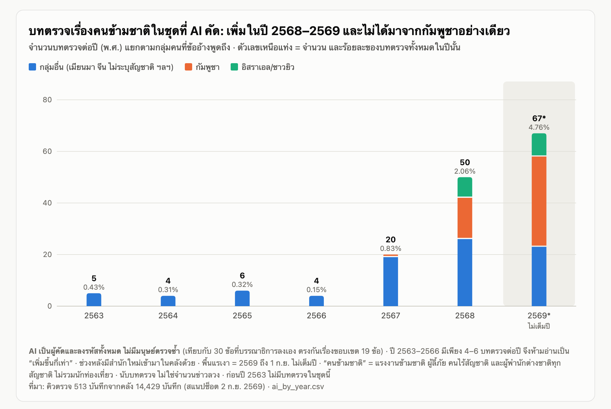
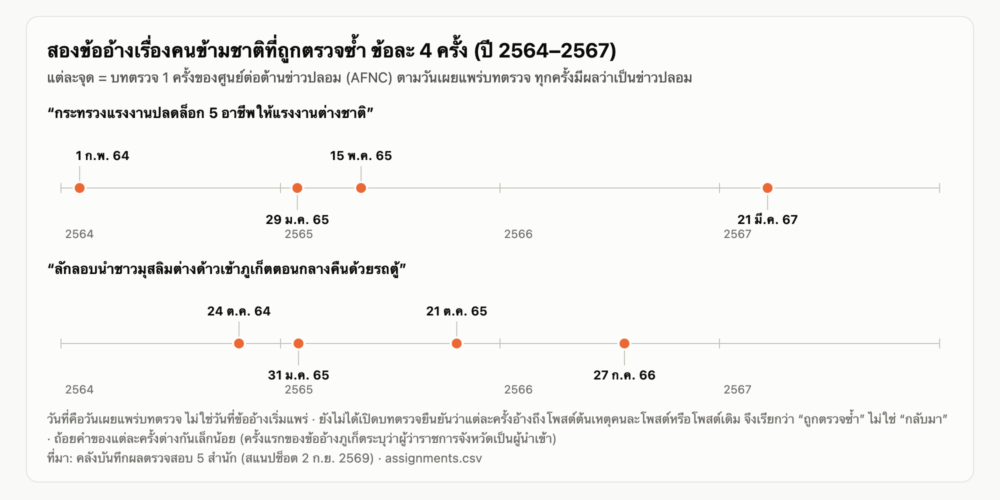

# ข่าวลวงว่าด้วย “คนข้ามชาติ” ในคลังตรวจข่าว: เรื่องเก่าที่วนกลับมา กับคลื่นใหม่สองลูก

> **สถานะ: ต้นฉบับสำหรับเจ้าของงานเรียบเรียงต่อ (ฉบับบทความยาว) ยังไม่พร้อมตีพิมพ์**
> เรียบเรียงจาก[ร่างทำงานฉบับที่ 3](story_2_draft_th.md) ตัวเลขทุกตัวมีที่มาในตารางท้ายร่างทำงาน
> **ข้อจำกัดที่กำหนดน้ำเสียงของทั้งเรื่อง:** การคัดว่าบทตรวจใด “เกี่ยวกับคนข้ามชาติ” และการลงรหัสกลุ่มคน ทำโดย **AI จากชื่อข่าวและข้ออ้างเท่านั้น ไม่มีมนุษย์ตรวจซ้ำ** เมื่อเทียบกับ 30 ข้อที่บรรณาธิการลงเอง ตรงกันเรื่องขอบเขต 19 ข้อ เรื่องนี้จึงเสนอได้เพียง **จำนวนบทตรวจและตัวอย่างที่อ้างรหัส** ไม่เสนอร้อยละของ “กรอบเรื่องเล่า” และไม่อ้างว่ารู้ว่าสังคมคิดอย่างไรกับคนข้ามชาติ
> เครื่องหมาย **【เติม】** = ต้องได้จากการสัมภาษณ์หรือลงพื้นที่ ไม่มีคำพูด ตัวบุคคล หรือฉากที่แต่งขึ้นในต้นฉบับนี้ **【ตรวจ】** = เปิดต้นทางยืนยันก่อนตีพิมพ์

**โปรย:** จากผลตรวจสอบข่าว 14,429 รายการของ 5 สำนัก มี 156 รายการที่พูดถึงคนข้ามชาติในไทย สามในสี่อยู่ในปี 2568–2569 และสามในสี่มาจากสำนักเดียว ข้ออ้างเรื่องบัตร สัญชาติ และอาชีพถูกตรวจซ้ำมาหลายปี ขณะที่สองปีหลังมีคลื่นใหม่สองลูก คือข้ออ้างที่ผูกกับความขัดแย้งไทย–กัมพูชา และข้ออ้างว่าชาวอิสราเอลมาตั้งถิ่นฐานในไทย

---

## 1. ภาพเก่าที่ได้คำบรรยายใหม่

**【เติม — ฉากเปิดที่ดีที่สุด】** หาผู้ที่เกี่ยวข้องกับภาพหรือกิจกรรมต้นฉบับ (ผู้จัดกิจกรรม ผู้ถ่ายภาพ หรือแรงงานในภาพที่ยินยอมและปลอดภัย) ถามว่าเห็นภาพของตัวเองถูกนำไปใช้ในโพสต์อย่างไร ห้ามระบุตัวตนหรือสถานะของใครที่อาจเสี่ยงต่อความปลอดภัย ถ้าได้ ให้ใช้ฉากนั้นแทนสองย่อหน้าถัดไป ถ้าไม่มีผู้ยินยอม ใช้ฉากจากเอกสารด้านล่าง

ต้นเดือนกุมภาพันธ์ 2568 AFP ประเทศไทยตรวจโพสต์ที่อ้างว่าแรงงานพม่าเรียกร้องค่าแรงขั้นต่ำ 700 บาท และสรุปว่าเป็นภาพเก่าที่ถูกแชร์ในโพสต์เท็จ (6 ก.พ. 2568) วันเดียวกัน Cofact ตรวจคลิปที่อ้างเรื่องเดียวกัน สิบเอ็ดวันต่อมา Thai PBS Verify ตรวจอีกครั้ง และระบุว่าเป็นภาพเก่าจากปี 2564 (17 ก.พ. 2568)

ภาพไม่ได้ถูกสร้างขึ้นใหม่ สิ่งที่เปลี่ยนคือคำบรรยาย

เรื่องนี้ตามดูว่า ในคลังของผู้ตรวจข่าวไทย ข้ออ้างเท็จและบิดเบือนเกี่ยวกับคนข้ามชาติมีหน้าตาอย่างไร เรื่องไหนถูกตรวจซ้ำ และเรื่องไหนเพิ่งเข้ามา

**【ตรวจ】** เปิด ID 16862 ([AFP](https://factcheckthailand.afp.com/doc.afp.com.36X87V2)), ID 27802 (Cofact) และ ID 27076 ([Thai PBS Verify](https://www.thaipbs.or.th/verify/content/431)) เก็บภาพหน้าจอพร้อมวันที่ ยืนยันว่าทั้งสามบทตรวจพูดถึงภาพหรือคลิปชุดเดียวกัน ที่มาของภาพต้นฉบับ และถ้อยคำที่ผู้ตรวจใช้ วันที่ในคลังคือวันเผยแพร่บทตรวจ ไม่ใช่วันที่โพสต์เริ่มแพร่

---

## 2. เรามองผ่านหน้าต่างไหน และมันแคบแค่ไหน

คลังที่ใช้คือชุดเดียวกับเรื่องที่ 1: บันทึกผลตรวจสอบจาก 5 สำนัก ได้แก่ ศูนย์ต่อต้านข่าวปลอม (AFNC), AFP ประเทศไทย, ชัวร์ก่อนแชร์, Cofact และ Thai PBS Verify ที่มีผลว่า “เท็จ” “บิดเบือน” หรือ “สื่อดัดแปลง” รวม 14,429 บันทึก ระหว่าง 30 พฤษภาคม 2558 ถึง 1 กันยายน 2569 ตัวเลขนี้นับ **บทตรวจสอบ** ไม่ใช่จำนวนข่าวลวง ไม่ใช่ยอดแชร์ และไม่ใช่ทัศนคติของสังคม

**“คนข้ามชาติ” ในเรื่องนี้หมายถึงใคร** แรงงานข้ามชาติ ผู้ลี้ภัย คนไร้สัญชาติ และผู้พำนักต่างชาติทุกสัญชาติที่อยู่ ทำงาน หรือทำธุรกิจในไทย รวมถึงคนที่ข้ามแดนมาใช้บริการในไทย ไม่รวมนักท่องเที่ยวและผู้มาเยือนระยะสั้น ไม่รวมข่าวการสู้รบหรือการเมืองระหว่างประเทศที่ไม่ได้พูดถึงตัวคน

การหาบทตรวจที่เกี่ยวข้องทำเป็นสี่ขั้น

1. **ค้นด้วยคำ** ได้ 128 บันทึกเป็นตั้งต้น
2. **ขยายด้วยความหมาย** หาบันทึกที่ข้อความคล้ายตั้งต้นอีก 204 บันทึก ได้คิวรอบแรก 332 บันทึก
3. **ขยายคิวหลังการตรวจสอบ** เพิ่มทุกบันทึกที่มีคำเรียกกลุ่มคนหรือชื่อประเทศเพื่อนบ้านคู่กับคำเกี่ยวกับคนหรือบริการ อีก 181 บันทึก ได้คิวรวม 513 บันทึก
4. **AI อ่านชื่อข่าวและข้ออ้างแล้วตัดสิน** คัดเข้า 156 บันทึก (ผู้อยู่อาศัย แรงงาน หรือสถานะ 114 และคนกับบริการข้ามแดน 42) กำกวม 17 และคัดออก 340

ขั้นที่สามสำคัญกว่าที่ดู เพราะ 42 จาก 156 บันทึกมาจากคิวที่ขยาย ซึ่งรวมข้ออ้างทั้งชุดที่รอบแรกไม่เคยดึงมา เช่นเรื่องชาวอิสราเอลในปายและเกาะพะงัน

ขั้นที่สี่คือจุดอ่อนที่ต้องบอกผู้อ่านตรง ๆ AI อ่านเฉพาะชื่อและข้ออ้าง ไม่ได้เปิดบทตรวจเต็ม และไม่มีมนุษย์ตรวจซ้ำ ข้อที่ AI ตัดสินว่า “กำกวม” ส่วนใหญ่เป็นข่าวชาวต่างชาติที่ไม่ระบุว่าเป็นผู้พำนักหรือนักท่องเที่ยว เช่นข่าวผู้ป่วยโควิดชาวต่างชาติในปี 2563 จึงไม่ถูกนับ และเมื่อเทียบกับ 30 ข้อที่บรรณาธิการลงเอง AI ตรงกันเรื่องขอบเขต 19 ข้อ ส่วนใหญ่ของข้อที่ต่างกันคือข่าวชายแดนกัมพูชา ซึ่งบรรณาธิการนับเป็นเรื่องคนข้ามแดน แต่ AI นับว่าอยู่นอกขอบเขต ตัวเลข 156 จึงควรอ่านว่าเป็นค่าประมาณของเครื่อง

น้ำหนักของคลังเอียงชัด จาก 156 บันทึก 120 บันทึก (76.9%) มาจาก AFNC ส่วน Cofact มี 21 บันทึก Thai PBS Verify 8 และ AFP 7 เรื่องที่ AFNC ไม่ตรวจแทบไม่ปรากฏในชุดนี้ ผลตรวจของ AFNC, AFP และ Thai PBS Verify เป็นของสำนักเอง ส่วน 21 บันทึกของ Cofact ทีมข้อมูลเป็นผู้ลงผลจากเนื้อหาบทความ

**【เติม — เสียงบรรณาธิการ ควรอยู่ต้นเรื่อง】** ถามบรรณาธิการ AFNC และ Cofact: ข่าวเกี่ยวกับ “ต่างด้าว” และชาวต่างชาติถูกเลือกมาตรวจจากอะไร (ร้องเรียน ยอดแชร์ คำขอจากหน่วยงาน เฝ้าระวังเอง) นโยบายเปลี่ยนเมื่อใด และเคยตัดสินใจไม่ตรวจเรื่องใดเพราะเสี่ยงซ้ำเติมอคติหรือไม่

---

## 3. เรื่องนี้ใหญ่แค่ไหนในคลัง

เล็กมากเกือบตลอดช่วงที่มีข้อมูล แล้วโตขึ้นในสองปีหลัง

| ปี | บทตรวจเรื่องคนข้ามชาติ (AI คัด) | บทตรวจทั้งหมดของปี | สัดส่วน | สัดส่วนเมื่อไม่นับกัมพูชา |
|---|---:|---:|---:|---:|
| 2563 | 5 | 1,166 | 0.43% | 0.43% |
| 2564 | 4 | 1,299 | 0.31% | 0.31% |
| 2565 | 6 | 1,899 | 0.32% | 0.32% |
| 2566 | 4 | 2,635 | 0.15% | 0.15% |
| 2567 | 20 | 2,408 | 0.83% | 0.79% |
| 2568 | 50 | 2,428 | 2.06% | 1.40% |
| 2569* | 67 | 1,407 | 4.76% | 2.27% |

*ถึง 1 ก.ย. ไม่เต็มปี ก่อนปี 2563 ไม่มีบทตรวจในชุดนี้ เพราะช่วงนั้นคลังเกือบทั้งหมดเป็นรายการสุขภาพของชัวร์ก่อนแชร์ (ดูเรื่องที่ 1)

*ภาพที่ 1 — บทตรวจเรื่องคนข้ามชาติในชุดที่ AI คัด แยกตามกลุ่มคนที่ข้ออ้างพูดถึง ตัวเลขเหนือแท่งคือจำนวนและร้อยละของบทตรวจทั้งหมดในปีนั้น ปี 2569 ไม่เต็มปี ฉบับโต้ตอบ: [chart_migrant_records_by_year.html](../20261008_story2_viz_v001/chart_migrant_records_by_year.html) · ข้อมูล: [migrant_records_by_year.csv](../20261008_story2_viz_v001/migrant_records_by_year.csv)*

ในคลังที่ศึกษา สัดส่วนบทตรวจเรื่องคนข้ามชาติต่ำกว่า 1% จนถึงปี 2567 แล้วเพิ่มในปี 2568 และ 2569 โดย 117 จาก 156 บันทึก (75.0%) อยู่ในสองปีหลัง

การเพิ่มนี้ไม่ได้มาจากกัมพูชาอย่างเดียว เมื่อไม่นับข้ออ้างที่พูดถึงคนกัมพูชา สัดส่วนยังเพิ่มจาก 0.79% เป็น 1.40% และ 2.27% และเมื่อไม่นับทั้งกัมพูชาและอิสราเอล ก็ยังเพิ่มจาก 0.79% เป็น 1.07% และ 1.63%

แต่ต้องไม่อ่านว่า “ข่าวลวงคนข้ามชาติเพิ่มขึ้นสิบเท่า” ด้วยเหตุผลสี่ข้อ ข้อแรก ฐานปี 2563–2566 มีเพียง 4–6 บันทึกต่อปี ข้อสอง ช่วงหลังมีสำนักใหม่เข้ามาในคลัง Cofact มีบทตรวจในชุดนี้ 1, 5 และ 15 รายการในปี 2567–2569 ข้อสาม ยังไม่ทราบว่าสำนักเปลี่ยนวิธีเลือกข่าวหรือไม่ และข้อสี่ ขอบเขตเป็นผลของ AI ที่ไม่ผ่านมนุษย์

---

## 4. ไม่ใช่สามยุค แต่เป็นเรื่องที่ทับถมกัน

สมมติฐานเดิมของโครงการคือ วาทกรรมเกี่ยวกับคนข้ามชาติเปลี่ยนเป็นสามยุค จากโรค ไปเศรษฐกิจ แล้วไปสิทธิทางการเมือง ข้อมูลรอบนี้ไม่ยืนยันเส้นเรื่องนั้น

ทีมข้อมูลใช้โมเดลจัดกลุ่มย่อยกับข้อความในชุดนี้ ได้ 9 กลุ่ม (ชื่อกลุ่มเป็นการตีความของผู้เขียนจากคำสำคัญ ไม่ใช่ป้ายที่ผู้เชี่ยวชาญรับรอง)

| กลุ่ม | รวม | 2563 | 2564 | 2565 | 2566 | 2567 | 2568 | 2569* |
|---|---:|---:|---:|---:|---:|---:|---:|---:|
| แรงงานกัมพูชา: กลับประเทศ ส่งกลับ ลักลอบ | 27 | 1 | 0 | 0 | 0 | 3 | 7 | 16 |
| เด็ก โรงเรียน เรียนฟรี ทุน | 21 | 0 | 0 | 0 | 0 | 2 | 2 | 17 |
| คนเมียนมา: สิทธิ ค่าแรง บัตร | 17 | 2 | 1 | 0 | 0 | 4 | 7 | 3 |
| ชาวกัมพูชาข้ามแดน: ด่าน โรงพยาบาล | 15 | 0 | 0 | 0 | 0 | 0 | 9 | 6 |
| ชาวอิสราเอล/ชาวยิว: ตั้งถิ่นฐาน อพยพ | 14 | 0 | 0 | 0 | 0 | 0 | 8 | 6 |
| ลักลอบ ภูเก็ต ขอทาน | 11 | 0 | 1 | 3 | 1 | 1 | 2 | 3 |
| วีซ่า ขึ้นทะเบียน บัตร | 9 | 0 | 0 | 0 | 1 | 2 | 4 | 2 |
| ใบขับขี่สำหรับชาวต่างชาติ | 7 | 0 | 0 | 0 | 1 | 2 | 4 | 0 |
| พ.ร.บ.สัญชาติ ลูกแรงงานได้สัญชาติ | 8 | 0 | 0 | 0 | 0 | 1 | 3 | 4 |
| ไม่เข้ากลุ่ม | 25 | 2 | 2 | 3 | 1 | 5 | 2 | 10 |
| ไม่มีป้ายกลุ่ม (เพิ่มหลังโมเดล) | 2 | 0 | 0 | 0 | 0 | 0 | 2 | 0 |

*ไม่เต็มปี โมเดลฝึกบนชุดคัดรอบก่อน (165 ข้อความ) แล้วนำป้ายมาใช้กับ 156 บันทึกนี้โดยไม่ฝึกใหม่ จำนวนกลุ่มขึ้นกับการตั้งค่า (4 ถึง 13 กลุ่มเมื่อปรับเกณฑ์)

ตารางนี้บอกสามอย่าง

**ปี 2563 เป็นปีของโรคระบาดจริง แต่ฐานเล็กมาก** ใน 5 บันทึกของปีนั้น 4 บันทึกผูกกับโควิด เช่น ภาพที่อ้างว่าเป็นคนแห่หนีการระบาดจากเมียนมามาไทย (AFP, 22 ก.ย. 2563) และข้ออ้างว่าชาวพม่าอพยพเข้าไทยหนีโควิดที่ด่านแม่สอด (AFNC, 6 ต.ค. 2563) ตัวเลขนี้น่าจะต่ำกว่าจริง เพราะข่าวชาวจีนหรือชาวต่างชาติติดโควิดอีก 6 รายการ AI ตัดสินว่ากำกวมและไม่นับ

**เรื่องบัตร สัญชาติ และอาชีพไม่ใช่ของใหม่** ปรากฏตั้งแต่ปี 2563–2566 และยังอยู่ถึงปี 2569

**สองปีหลังไม่ได้แทนที่เรื่องเดิม แต่ซ้อนเพิ่ม** กลุ่มที่เกิดใหม่ในปี 2568 คือชาวกัมพูชาข้ามแดนและชาวอิสราเอล ขึ้นมาพร้อมกับที่กลุ่มเดิมยังมีบทตรวจอยู่

สิ่งที่เห็นจึงเป็นเรื่องเดิมที่ยังอยู่และมีเรื่องใหม่ทับเพิ่ม ไม่ใช่ยุคหนึ่งหายไปแล้วอีกยุคเข้ามาแทน แต่ด้วยฐาน 4–6 บันทึกต่อปีในช่วงแรก ก็ปฏิเสธสมมติฐานสามยุคอย่างเด็ดขาดไม่ได้เช่นกัน

**【ตรวจ】** อ่านทุกแถวของกลุ่มที่เรียกชื่อในเรื่อง รวมแถวที่ไม่เข้ากลุ่ม 25 แถว ซึ่งมีข้ออ้างสำคัญปนอยู่ (ดูตอนถัดไป)

---

## 5. เรื่องเก่าที่ถูกตรวจซ้ำ

สองข้ออ้างในคลังถูกตรวจซ้ำหลายปีด้วยถ้อยคำแทบเหมือนเดิม

ข้อแรก “กระทรวงแรงงานปลดล็อก 5 อาชีพให้แรงงานต่างชาติ” AFNC ตรวจ 4 ครั้ง คือ 1 ก.พ. 2564, 29 ม.ค. 2565, 15 พ.ค. 2565 และ 21 มี.ค. 2567 ทุกครั้งเป็นข่าวปลอม

ข้อสอง “ลักลอบนำชาวมุสลิมต่างด้าวเข้าภูเก็ตตอนกลางคืนด้วยรถตู้” AFNC ตรวจข้ออ้างแนวนี้ 4 ครั้ง คือ 24 ต.ค. 2564 (ฉบับที่อ้างว่าผู้ว่าราชการจังหวัดเป็นผู้นำเข้า), 31 ม.ค. 2565, 21 ต.ค. 2565 และ 27 ก.ค. 2566 ทุกครั้งเป็นข่าวปลอม

*ภาพที่ 2 — สองข้ออ้างที่ AFNC ตรวจซ้ำข้อละ 4 ครั้ง ตามวันเผยแพร่บทตรวจ ฉบับโต้ตอบ: [chart_recurring_claims.html](../20261008_story2_viz_v001/chart_recurring_claims.html) · ข้อมูล: [recurring_claims.csv](../20261008_story2_viz_v001/recurring_claims.csv)*

ข้ออ้างแรกโมเดลจัดเป็น “ไม่เข้ากลุ่ม” ทั้งสี่ครั้ง เพราะมีไม่ถึงขนาดกลุ่มขั้นต่ำ นี่เป็นบทเรียนเรื่องวิธี โมเดลช่วยทำแผนที่ แต่เรื่องที่กลับมาซ้ำด้วยตัวเลขเล็กอาจเป็นเรื่องที่นักข่าวควรให้ความสำคัญที่สุด และต่างจากเรื่องที่ 1 ที่ข้อความซ้ำส่วนใหญ่เป็นรายการนำตอนเก่ามาเผยแพร่ใหม่ ข้ออ้างสองข้อนี้เป็นบทตรวจใหม่แต่ละครั้ง

**【ตรวจ】** เปิดบทตรวจทั้ง 8 รายการ (ID 15406, 13929, 13177, 7940 และ 14480, 13918, 12036, 9740) ดูว่าแต่ละครั้งอ้างถึงโพสต์ต้นเหตุคนละโพสต์หรือไม่ ถ้าเป็นโพสต์เดียวกันที่ถูกตรวจซ้ำ ให้เขียนว่า “ถูกตรวจซ้ำ” ไม่ใช่ “กลับมา”

**【เติม】** ถาม AFNC กระทรวงแรงงาน และจังหวัดภูเก็ต: ทำไมข้ออ้างสองข้อนี้ถูกตรวจซ้ำ กฎจริงเรื่องอาชีพสงวนเปลี่ยนเมื่อใด และข้ออ้างเรื่องภูเก็ตเริ่มจากเหตุการณ์ใด

---

## 6. บัตร เอกสาร และสัญชาติ: คำเดียวที่กลืนหลายสิทธิ

กลุ่มเรื่องวีซ่า การขึ้นทะเบียน และกฎหมายสัญชาติรวมกัน 17 บันทึก และยังมีข้ออ้างแนวเดียวกันกระจายอยู่ในกลุ่มอื่น ตัวอย่างเรียงตามเวลา

- เพจอ้างเปิดลงทะเบียนทำบัตรประชาชนต่างด้าว (AFNC, 20 มิ.ย. 2566) — ข่าวปลอม
- จ้างเปลี่ยนสัญชาติจีนเป็นไทย ได้ใบเกิด ทะเบียนบ้าน และบัตรประชาชน (AFNC, 12 ส.ค. 2567) — ข่าวปลอม
- เปิดให้แรงงานต่างด้าวขึ้นทะเบียน แม้แรงงานเถื่อนก็ขึ้นได้ (AFNC, 30 พ.ย. 2567) — บิดเบือน
- ลูกแรงงานต่างด้าวมีสิทธิ์ขอสัญชาติไทย (AFNC, 8 ม.ค. 2568) — บิดเบือน
- คนต่างด้าวทำบัตรประชาชนคนไทยได้แล้ว (AFNC, 9 ก.ค. 2568) — ข่าวปลอม
- กรมการปกครองเสนอแก้ พ.ร.บ.สัญชาติ เปิดช่องให้ลูกแรงงานต่างด้าวที่เกิดในไทยได้สัญชาติ (Cofact, 26 ธ.ค. 2568) — บิดเบือน
- ต่างด้าวสวมสิทธิ์โครงการคนละครึ่งได้ (AFNC, 26 ม.ค. 2569) — ข่าวปลอม
- คนต่างด้าวแม้เป็นแรงงานผิดกฎหมาย หากคลอดลูกในไทยจะได้สัญชาติทันที (AFNC, 19 มิ.ย. 2569) — ข่าวปลอม

เส้นเรื่องที่คลังเห็นคือ ข้ออ้างหลายอย่างวนรอบเส้นแบ่งระหว่างการมีเอกสาร การทำงานอย่างถูกกฎหมาย และการเป็นพลเมือง ตั้งแต่ปลายปี 2568 มีข้ออ้างชุดใหม่ที่ผูกกับร่างแก้ไข พ.ร.บ.สัญชาติ 8 บันทึก โดย 5 บันทึกเป็นของ Cofact

แต่ “ข้ออ้างวนรอบเรื่องเดียวกัน” ไม่เท่ากับ “ข้ออ้างทำให้คนเชื่อว่าคนข้ามชาติได้สิทธิเกินควร” อย่างหลังเป็นเรื่องของกรอบเรื่องเล่า ซึ่งต้องเปิดต้นทางอ่านเองก่อนเขียน

**【เติม — ทางแยกคำศัพท์ ต้องมีในเรื่อง】** อธิบายความต่างของ สถานะเข้าเมือง · ใบอนุญาตทำงาน · ทะเบียนบุคคล/เลข 13 หลัก · บัตรสีชมพู · สิทธิการศึกษา · สิทธิรักษาพยาบาล · สัญชาติโดยการเกิดและโดยการขอ ตามแหล่งทางการ (กรมการปกครอง กรมการจัดหางาน) และถามผู้เชี่ยวชาญกฎหมายสัญชาติว่าร่างแก้ไขมาตรา 7 ทวิ เสนออะไรจริง และข้ออ้างใดบิดเบือนจากกฎจริงตรงไหน

---

## 7. “ภาษีคนไทย”: ข้ออ้างเรื่องสิทธิและทรัพยากร

กลุ่มที่พูดถึงคนเมียนมามี 17 บันทึก มีทั้งในปี 2563 และปี 2569 ข้ออ้างในช่วงปี 2567–2569 มีแบบแผนใกล้กัน

- แรงงานชาวเมียนมาเรียกร้องสิทธิเทียบเท่าคนไทย (AFNC, 19 ส.ค. 2567) — ข่าวปลอม
- เงินภาษีคนไทยถูกใช้ให้สิทธิคนพม่า (Thai PBS Verify, 24 ต.ค. 2567) — บิดเบือน
- เลือดสำรองของคนไทยถูกนำไปให้คนพม่าใช้จนโลหิตในคลังขาดแคลน (AFNC, 14 ม.ค. 2568) — บิดเบือน
- ออกบัตรประชาชนให้คนพม่าเป็นสัญชาติไทยโดยไม่ตรวจประวัติ (AFNC, 15 ม.ค. 2568) — ข่าวปลอม
- ประชากรพม่าใน จ.สมุทรสาคร มากกว่าประชากรไทยในพื้นที่ (AFNC, 21 มี.ค. 2568) — ข่าวปลอม
- รัฐบาลให้สิทธิบัตรสวัสดิการแห่งรัฐกับคนพม่า (AFNC, 12 มิ.ย. 2569) — ข่าวปลอม

ข้ออ้างเรื่องค่าแรง 700 บาทในฉากเปิดก็อยู่ในกลุ่มนี้ และมีสามสำนักตรวจในเดือนเดียวกัน

สามจากหกข้อข้างบนไม่เคยอยู่ในคิวรอบแรก เพราะใช้คำว่า “พม่า” เฉย ๆ โดยไม่มีคำว่าแรงงานหรือต่างด้าว

**【ตรวจ】** ผลตรวจของหลายข้อเป็น “บิดเบือน” ไม่ใช่ “เท็จ” แปลว่ามีข้อเท็จจริงบางส่วนอยู่ ต้องเปิดบทตรวจ (ID 6542, 27145, 5180, 5170, 4571, 286) ดูว่าส่วนใดจริง เช่น สิทธิรักษาพยาบาลของผู้ประกันตน หรือการรับบริจาคโลหิต ก่อนเขียน ข้อความของ ID 27145 และ 27076 สกัดโดย LLM ต้องเทียบกับต้นทาง

**【เติม】** ถามหน่วยบริการสาธารณสุข สภากาชาดไทย และสำนักงานประกันสังคม: คนข้ามชาติเข้าถึงบริการเหล่านี้ภายใต้เงื่อนไขใด ใครเป็นผู้จ่าย และตัวเลขจริงเป็นเท่าไร

---

## 8. คลื่นที่ผูกกับกัมพูชา

ในปี 2568–2569 มีบทตรวจเรื่องคนข้ามชาติ 117 บันทึก และ 51 บันทึก (43.6%) พูดถึงคนกัมพูชา ปี 2567 มี 1 บันทึก และก่อนหน้านั้นไม่มีเลย

ข้ออ้างแบ่งได้สองแนว

**แนวแรก แรงงานกัมพูชาในไทย** (27 บันทึก) เช่น สั่งจับแรงงานกัมพูชาส่งกลับประเทศ (AFNC, 8 ส.ค. 2568, บิดเบือน), แรงงานกัมพูชาในไทยแห่กลับบ้านกว่า 8 แสนคน (AFNC, 14 ส.ค. 2568, บิดเบือน) และแรงงานกัมพูชากว่า 7 แสนคนไม่ยอมกลับประเทศ ยอมจ่ายเงินเพื่อให้ได้สัญชาติไทย (AFNC, 12 มี.ค. 2569, ข่าวปลอม)

**แนวที่สอง ชาวกัมพูชาข้ามแดนมาใช้บริการ** (15 บันทึก ทั้งหมดในปี 2568–2569) เช่น ตม.ไทยเปิดด่านให้ชาวกัมพูชาเข้ามาใช้บริการโรงพยาบาลตามปกติ (AFNC, 27 ส.ค. 2568, ข่าวปลอม), ไทยขายใบนัดแพทย์ปลอมให้คนกัมพูชาใช้ข้ามแดน (AFNC, 9 ต.ค. 2568, ข่าวปลอม) และชาวกัมพูชาพยายามแหกด่านเพื่อมารักษาวัณโรคฟรีที่ไทย (AFNC, 13 มี.ค. 2569, ข่าวปลอม)

คลื่นนี้ขึ้นพร้อมกับข้ออ้างเรื่องทหารและชายแดนไทย–กัมพูชาที่เรื่องที่ 1 รายงานไว้ แต่บทตรวจในชุดนี้คัดเฉพาะที่พูดถึงตัวคน ไม่รวมข่าวการสู้รบ และต้องไม่เขียนว่าการเพิ่มทั้งหมดเป็นเรื่องกัมพูชา หรือว่าเป็นการเปลี่ยนวิธีเล่าเรื่องคนข้ามชาติโดยรวม

**【ตรวจ】** วางลำดับเหตุการณ์ความขัดแย้งไทย–กัมพูชาจากแหล่งทางการเทียบกับวันที่ของบทตรวจ (ID 3233, 3176, 1174, 3045, 2644, 1166) และแยกทีละแถวว่าข้อใดพูดถึงตัวคนจริง เส้นแบ่งระหว่าง “ข่าวชายแดน” กับ “ข่าวคนข้ามแดน” คือจุดที่ AI กับบรรณาธิการเห็นต่างกันมากที่สุด

**【เติม】** หน่วยบริการสาธารณสุขชายแดนและด่านตรวจคนเข้าเมือง: นโยบายรักษาผู้ป่วยข้ามแดนจริงคืออะไร เปลี่ยนไปอย่างไรระหว่างความขัดแย้ง

---

## 9. โรงเรียน: จากสองข้ออ้างในปี 2567 สู่สิบเจ็ดในปี 2569

กลุ่มเรื่องเด็กและโรงเรียนมี 21 บันทึก คือ 2 ในปี 2567, 2 ในปี 2568 และ 17 ในแปดเดือนแรกของปี 2569 ซึ่งมาจากสามสำนัก (AFNC 8, Cofact 7, Thai PBS Verify 2)

- โรงเรียนแห่งหนึ่งในไทยให้นักเรียนเข้าแถวร้องเพลงชาติเมียนมาทุกเช้า (AFNC, 5 ก.ย. 2567) — ข่าวปลอม
- เด็กไทยต้องเสียค่าเทอม แต่เด็กต่างชาติได้เรียนฟรีโดยใช้ภาษีจากคนไทย (AFNC, 11 ก.ย. 2567) — บิดเบือน
- ด่านคลองลึกเปิดให้นักเรียนกัมพูชาข้ามแดนโดยไม่ใช้เอกสารผ่านแดน (AFNC, 30 มิ.ย. 2568) — บิดเบือน
- ยกเลิกประกาศของ ศธ. ที่ให้เด็กต่างชาติเรียนฟรีถึงระดับปริญญาตรี (AFNC, 8 มี.ค. 2569) — บิดเบือน
- ไทยให้เด็กต่างชาติเรียนฟรีถึงปริญญาตรี (Cofact, 24 เม.ย. 2569) — บิดเบือน
- รัฐมนตรีว่าการกระทรวงศึกษาธิการให้ทุนการศึกษาเด็กกัมพูชา 800 ล้านบาท (AFNC, 1 มิ.ย. 2569) — ข่าวปลอม
- เด็กเขมรเรียนฟรีแต่เด็กไทยต้องกู้ กยศ. (Cofact, 9 มิ.ย. 2569) — ข่าวปลอม

สองข้ออ้างแรกอยู่ในปี 2567 และพูดถึงเด็กเมียนมากับเด็กต่างชาติทั่วไป ส่วนปี 2569 ข้ออ้างส่วนใหญ่ผูกกับเด็กกัมพูชา (13 จาก 21 บันทึกของกลุ่ม) การที่สามสำนักตรวจเรื่องเดียวกันในปีเดียวบอกว่ามีประเด็นนโยบายหรือกระแสหนึ่งที่ถูกตรวจซ้ำ

ห้ามเขียนว่า “เพิ่ม 8 เท่า” ฐานเล็ก เป็นชุดที่ AI คัด และปี 2569 ไม่เต็มปี

**【ตรวจ】** เปิด ID 6389, 6337, 3633, 1215, 28026, 391, 27293 โดยเฉพาะข้อที่ผลเป็น “บิดเบือน” ให้ดูว่าส่วนใดของข้ออ้างจริง

**【เติม】** ถามกระทรวงศึกษาธิการ กสม. และโรงเรียนที่รับเด็กไม่มีสัญชาติไทย: เงื่อนไขการรับเรียนและแหล่งงบประมาณจริงคืออะไร ครูและผู้ปกครองพบข่าวลวงนี้อย่างไร และส่วนใดในโพสต์ที่จริง ผิด หรือผิดบริบท

---

## 10. ผู้มาตั้งถิ่นฐาน: คลื่นใหม่ที่ไม่ใช่แรงงานเพื่อนบ้าน

ตั้งแต่กุมภาพันธ์ 2568 คลังมีข้ออ้างชุดหนึ่งที่ไม่เกี่ยวกับแรงงานจากประเทศเพื่อนบ้านเลย คือข้ออ้างว่าชาวอิสราเอลหรือชาวยิวมาตั้งถิ่นฐานในไทย มี 17 บันทึก คือ 8 ในปี 2568 และ 9 ในแปดเดือนแรกของปี 2569 เป็นของ AFNC 14 และ AFP 3

- ชาวยิวอิสราเอลกว่า 30,000 คนมาตั้งถิ่นฐานใน อ.ปาย (AFNC, 19 ก.พ. 2568) — บิดเบือน
- ชาวอิสราเอลย้ายมา “ตั้งถิ่นฐาน” ใน อ.ปาย หลังอิสราเอล–ฮามาสหยุดยิง (AFP, 20 ก.พ. 2568) — เท็จ
- ชาวยิวที่มาตั้งถิ่นฐานใน อ.ปาย ไม่ใช่นักท่องเที่ยว แต่เป็นหน่วยรบ (AFNC, 23 ก.พ. 2568) — บิดเบือน
- ชาวอิสราเอลหลายพันคนย้ายเข้ามาตั้งถิ่นฐานที่เกาะพะงัน (AFNC, 7 พ.ย. 2568) — บิดเบือน
- รัฐบาลจัดสรรพื้นที่ให้ชาวยิวที่อพยพมาอยู่ในไทยเพิ่มเติม (AFNC, 19 มี.ค. 2569) — ข่าวปลอม
- ชาวอิสราเอล 425,000 คนเตรียมอพยพเข้าไทย (AFNC, 28 มี.ค. 2569 และ AFP, 31 มี.ค. 2569) — ข่าวปลอม
- ชาวอิสราเอลอพยพเข้าไทยปีละ 5 หมื่นคน ยึดปาย พะงัน และนราธิวาสผ่านนอมินี (AFNC, 23 พ.ค. 2569) — ข่าวปลอม

ข้ออ้างชุดนี้ใช้คำชุดเดียวกับข้ออ้างเรื่องแรงงานเพื่อนบ้าน คือตั้งถิ่นฐาน อพยพ ยึดพื้นที่ และนอมินี แต่ใช้กับคนอีกกลุ่ม และ 7 จาก 17 บันทึกมีผลตรวจว่า “บิดเบือน” ไม่ใช่ “เท็จ” ซึ่งแปลว่าบทตรวจพบข้อเท็จจริงบางส่วนที่ถูกขยายหรือบิดความ ต้องเปิดบทตรวจดูว่าส่วนใดจริง

ข้ออ้างเกี่ยวกับผู้พำนักชาวจีนมีน้อยกว่า (7 บันทึก โดย 6 บันทึกอยู่ในปี 2568) และเป็นเรื่องเอกสารกับธุรกิจ เช่น จ้างเปลี่ยนสัญชาติจีนเป็นไทย (12 ส.ค. 2567), ชาวจีนเปิดร้านค้าในไทยได้โดยไม่ต้องมีวีซ่า (20 ก.ค. 2568) และ “จีนเทา” บุกรุกถางป่าปลูกทุเรียนใน จ.ตราด (13 ก.พ. 2568)

ข้ออ้างเกือบทั้งหมดในตอนนี้ไม่เคยอยู่ในคิวรอบแรก

**【ตรวจ】**
- เปิดบทตรวจทุกข้อ (ID 4851, 17181, 4811, 2382, 1108, 1022, 16722, 480) แยกให้ชัดว่าส่วนใดจริงและส่วนใดเท็จในข้ออ้างที่ผลเป็น “บิดเบือน”
- ขอตัวเลขผู้เดินทางเข้าและผู้พำนักชาวอิสราเอลจากสำนักงานตรวจคนเข้าเมือง ห้ามใช้ตัวเลขจากโพสต์
- เรื่องนี้เสี่ยงต่อการขยายความเกลียดชังทางเชื้อชาติและศาสนา เขียนถึงข้ออ้าง ไม่ทำซ้ำถ้อยคำที่เหมารวม และไม่ใช้ภาพบุคคลโดยไม่ยินยอม

**【เติม】** ผู้อยู่อาศัยและผู้ประกอบการใน อ.ปาย และเกาะพะงัน เจ้าหน้าที่ท้องถิ่น และตัวแทนชุมชนชาวอิสราเอลที่ยินยอม: เกิดอะไรขึ้นจริงในพื้นที่ ข้ออ้างออนไลน์ส่งผลต่อความสัมพันธ์ในชุมชนอย่างไร

---

## 11. ปิดเรื่อง: คนที่ถูกพูดแทน

**【เติม — เสียงของคนข้ามชาติ】** สัมภาษณ์แรงงาน ครอบครัว ครู หรือคนทำงานกับกลุ่มคนข้ามชาติที่ยินยอมและปลอดภัย (ผ่านองค์กรที่ไว้ใจ ไม่ถามสถานะการเข้าเมือง ไม่เปิดเผยตัวตน) ถามว่ารู้จักข่าวเหล่านี้หรือไม่ ผลต่อชีวิตประจำวันคืออะไร และอยากให้สื่อเปลี่ยนวิธีรายงานอย่างไร

**ย่อหน้าสรุป (ปรับได้เมื่อมีเสียงภาคสนาม):**

ในคลังตรวจข่าว คนข้ามชาติเป็นหัวข้อของข้ออ้างมากกว่าผู้พูดในข้ออ้าง สิ่งที่ข้อมูลบอกได้คือ ข้ออ้างเหล่านั้นวนอยู่รอบบัตร สัญชาติ งาน โรงเรียน โรงพยาบาล และที่ดิน และเมื่อมีคนกลุ่มใหม่เข้ามาอยู่ในข่าว คำชุดเดิมก็ถูกใช้กับคนกลุ่มนั้น แต่ข้อมูลไม่ได้บอกว่าผู้อ่านเชื่ออะไรและรู้สึกอย่างไร นั่นต้องถามคนจริง

---

## กล่องวิธีวิจัยสำหรับผู้อ่าน

**ข้อมูลที่ใช้:** บันทึกผลตรวจสอบข่าวที่มีผลว่าเท็จ บิดเบือน หรือสื่อดัดแปลงจาก 5 สำนัก 14,429 บันทึก ระหว่าง 30 พ.ค. 2558–1 ก.ย. 2569 ไม่ใช่จำนวนข่าวลวงทั้งหมดในไทย

**“คนข้ามชาติ” หมายถึง:** แรงงานข้ามชาติ ผู้ลี้ภัย คนไร้สัญชาติ และผู้พำนักต่างชาติทุกสัญชาติในไทย ไม่รวมนักท่องเที่ยว

**หาเรื่องคนข้ามชาติอย่างไร:** ค้นด้วยคำ ขยายด้วยความคล้ายทางความหมาย ขยายด้วยคำเรียกกลุ่มคนอีกรอบหลังพบว่าตกหล่น ได้คิว 513 บันทึก แล้วให้ AI อ่านชื่อข่าวและข้ออ้างเพื่อตัดสินว่าเกี่ยวข้องหรือไม่ ได้ 156 บันทึก **การตัดสินทั้งหมดเป็นของ AI ไม่มีมนุษย์ตรวจซ้ำ** เมื่อเทียบกับ 30 บันทึกที่บรรณาธิการลงเอง ตรงกันเรื่องขอบเขต 19 บันทึก รายงานนี้จึงเสนอจำนวนบทตรวจและตัวอย่าง ไม่เสนอร้อยละของกรอบเรื่องเล่า

**จัดกลุ่มอย่างไร:** แปลงข้อความเป็นเวกเตอร์ความหมาย (E5) ลดมิติ (UMAP) จัดกลุ่มตามความหนาแน่น (HDBSCAN) และสรุปคำสำคัญด้วย BERTopic จำนวนกลุ่มขึ้นกับการตั้งค่า ชื่อกลุ่มเป็นการตีความของผู้เขียน

**ข้อจำกัดสำคัญ:** (1) สามในสี่ของบทตรวจในชุดมาจากสำนักเดียว (2) ฐานต่อปีก่อน 2567 มีเพียง 4–6 บันทึก (3) ปี 2569 ไม่เต็มปี (4) วันที่คือวันเผยแพร่บทตรวจ (5) เรื่องที่ไม่มีสำนักใดเลือกตรวจไม่อยู่ในคลัง (6) ขอบเขตและกลุ่มคนเป็นผลของ AI

---

## ก่อนส่งต้นฉบับ (สำหรับเจ้าของงาน)

- แผนสัมภาษณ์ ตารางที่มาของตัวเลขทุกตัว และรายการ ID ที่ต้องเปิดต้นทาง อยู่ที่ท้าย[ร่างทำงาน](story_2_draft_th.md)
- คำต้องห้ามตามร่างทำงาน: “ข่าวลวงคนข้ามชาติพุ่ง/เพิ่ม X เท่า”, “สังคมไทยเกลียดแรงงาน/ชาวต่างชาติมากขึ้น”, “โมเดลพิสูจน์วาทกรรม…”, “คนข้ามชาติถูกวางเป็นผู้ร้าย/ผู้แย่งงาน”, “ข่าวชายแดนทุกชิ้นคือข่าวแรงงาน” และการทำซ้ำถ้อยคำเหมารวมเชื้อชาติหรือศาสนา
- ถ้าต้องการเขียนเรื่อง “กรอบ” (ใครถูกวางเป็นต้นเหตุ ใครเสียหาย) ต้องมีคนลงรหัสสุ่มราว 60 ข้อโดยไม่เห็นคำตอบของ AI ก่อน ผลของ AI อยู่ที่ `deliverables/story2_coding/ai_coded/ai_coding_v1.csv`
- สัมภาษณ์คนข้ามชาติต้องมีการยินยอมเป็นลายลักษณ์อักษร และใช้แนวทางความปลอดภัยก่อนเริ่ม
